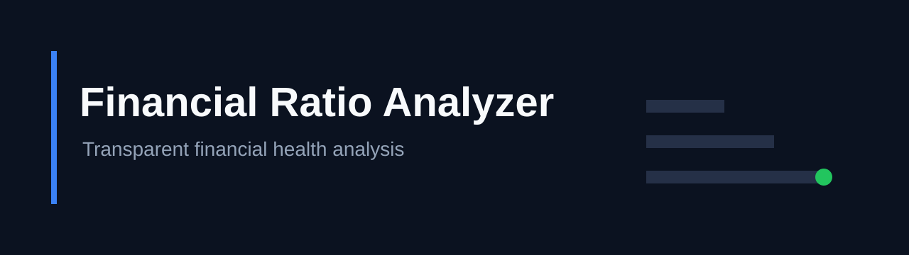
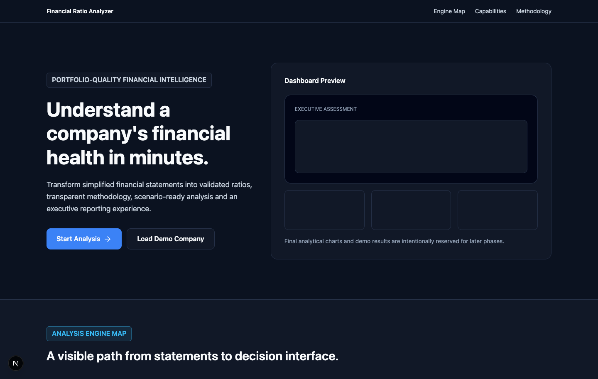
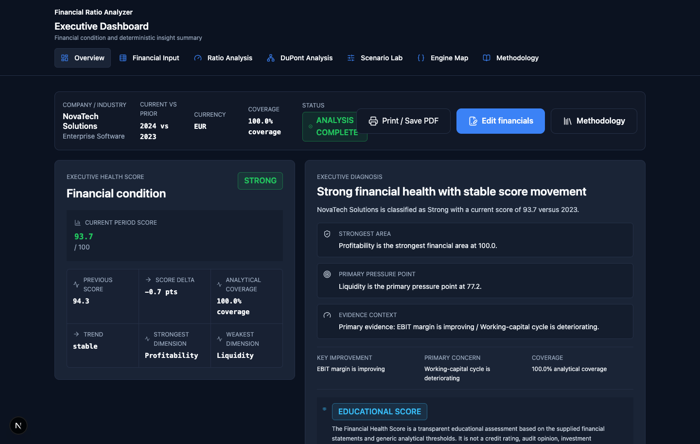
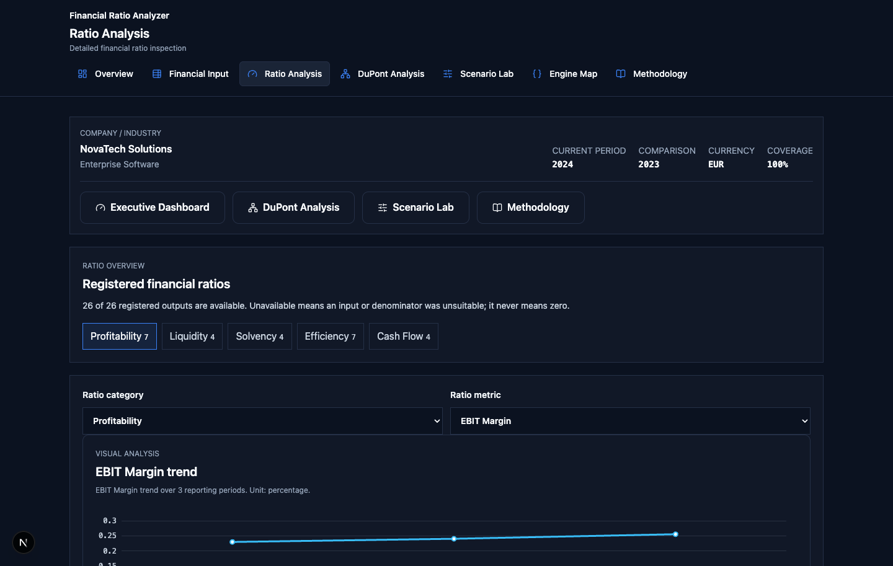
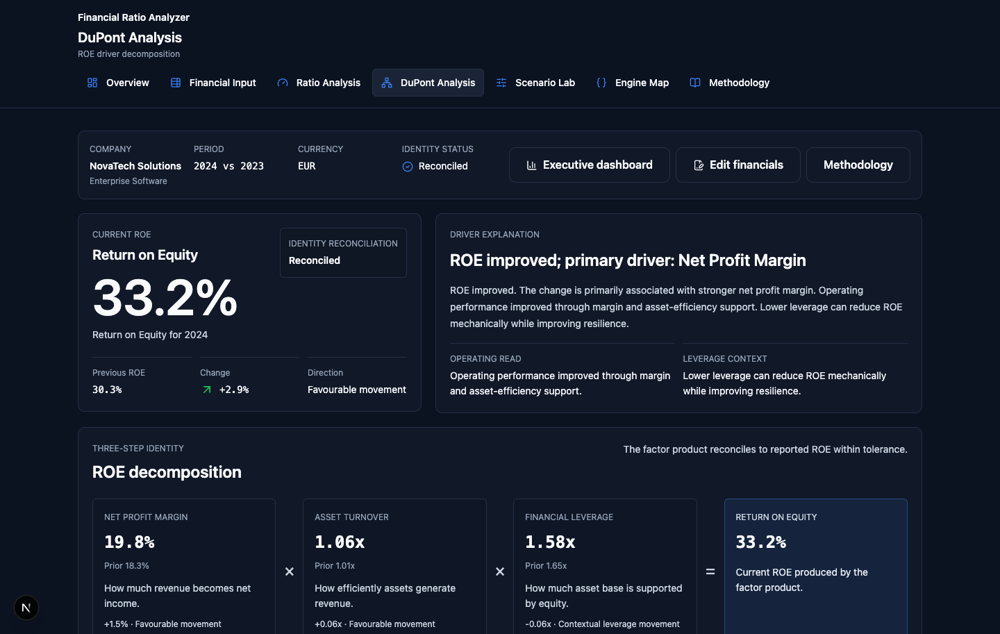
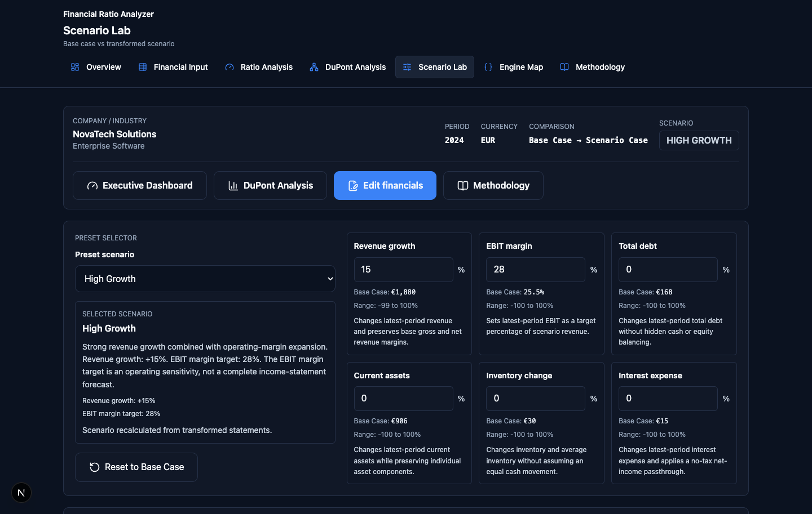
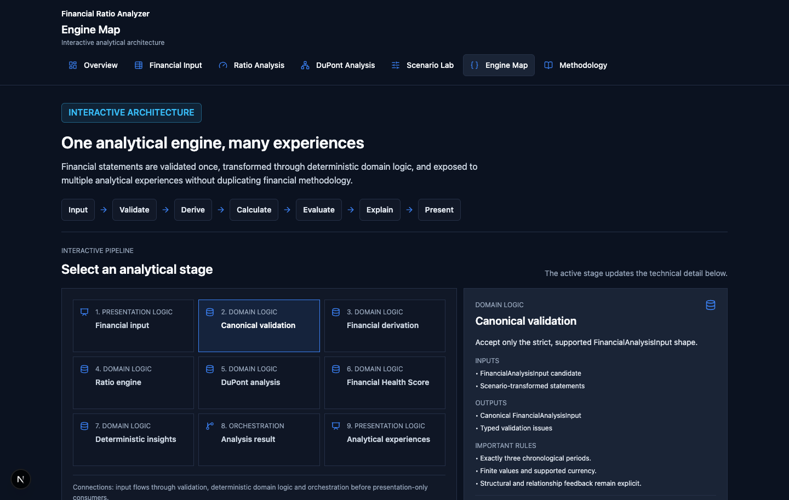
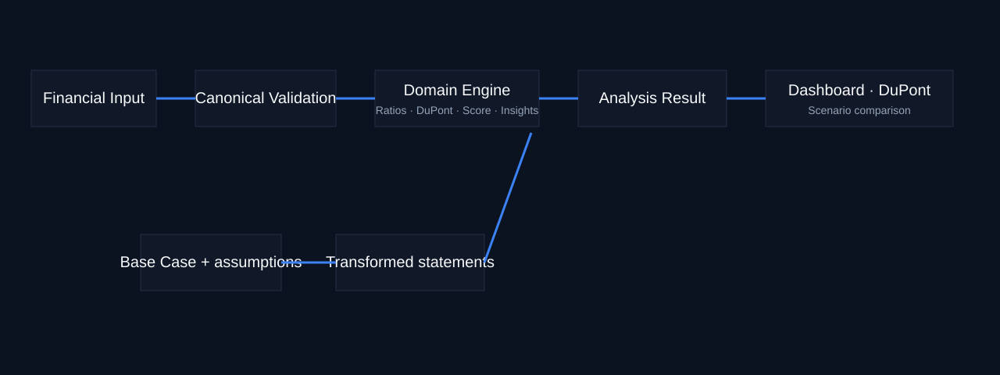

# EQUIVERSE



Transparent, deterministic financial health analysis for simplified three-period financial statements.

**Live demo:** deployment pending final release phase.

## Product overview

EQUIVERSE, formerly Financial Ratio Analyzer, validates canonical financial statements, calculates registered ratios, explains Return on Equity through DuPont, creates a transparent Financial Health Score, generates deterministic evidence-backed insights, and compares statement-based scenarios.

## Key features

- Three-period financial input with canonical validation
- Registered profitability, liquidity, solvency, efficiency and cash-flow ratios
- Transparent 0–100 Financial Health Score with coverage disclosure
- Deterministic strengths and risks, not generative AI
- DuPont identity and order-independent ROE driver attribution
- Read-only Ratio Analysis workspace and trend explorer
- Statement-based Scenario Lab with immutable Base Case
- Interactive Engine Map and browser Print / Save PDF action

## Walkthrough and screenshots













## Analytical architecture



Financial Input → Canonical Validation → Domain Engine (Ratios, DuPont, Score, Insights) → FinancialAnalysisResult → Dashboard, DuPont and Scenario experiences. Scenario Lab transforms statements then reuses the same engine.

## Methodology

Read [docs/methodology.md](docs/methodology.md), [formulas](docs/formulas.md), [scoring methodology](docs/scoring-methodology.md) and [scenario methodology](docs/scenario-methodology.md). The score is an educational assessment, not a credit rating or recommendation.

## Technology stack

Next.js, React, TypeScript, Tailwind CSS, ECharts, React Hook Form, Zod, Vitest and Testing Library.

## Repository structure

`src/app` routes · `src/domain` pure analytical logic · `src/features` product experiences · `src/components` shared UI · `src/test` automated checks · `docs` methodology · `assets` repository media.

## Getting started

```bash
npm install
npm run dev
```

Then open `http://localhost:3000`.

```bash
npm run typecheck
npm run lint
npm run test
npm run build
```

Phase 10 validation records the current test count in the final QA report; this count will naturally grow as coverage evolves.

## Print / Save PDF

Use **Print / Save PDF** in the Executive Dashboard to open the browser print flow. This is browser-native reporting, not server-generated PDF infrastructure.

## Demo companies and limitations

NovaTech Solutions and Atlas Manufacturing Group are fictional demonstration companies. The model uses generic thresholds and supplied financial statements; it does not provide audit assurance, creditworthiness, investment advice, forecasts or real-company analysis.

## Project status

Phases 0–10 are implemented and validated. Production deployment remains pending the final release step.

## Licence

No licence has been selected yet.
