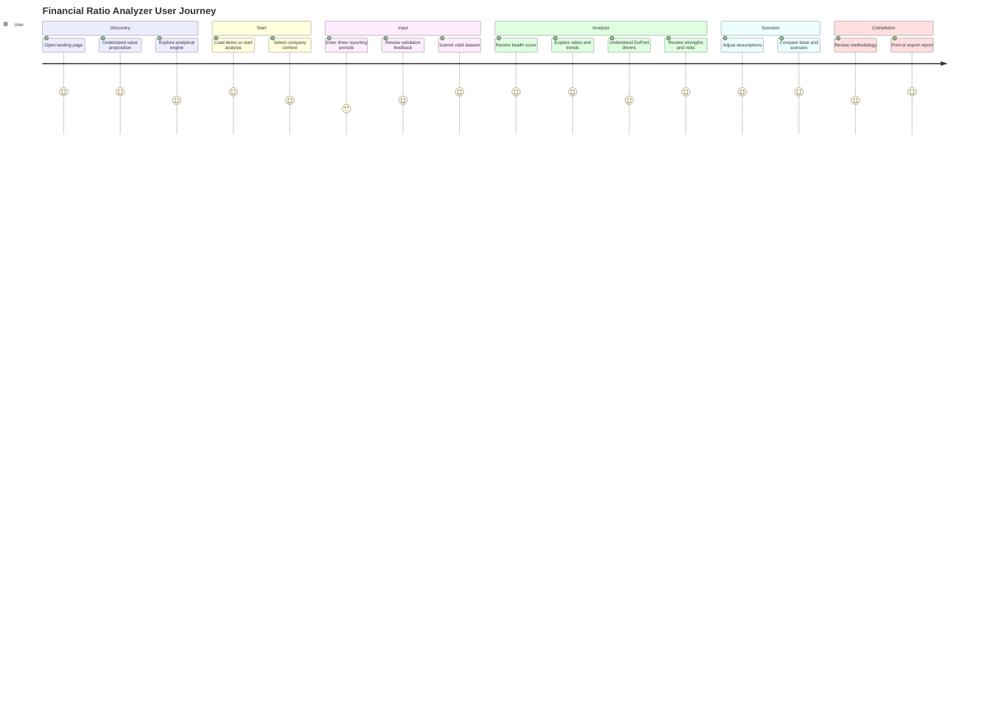
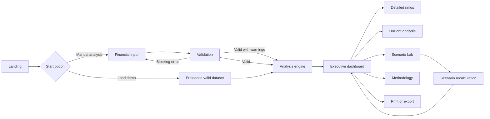
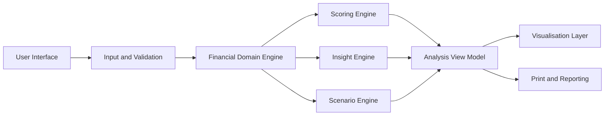
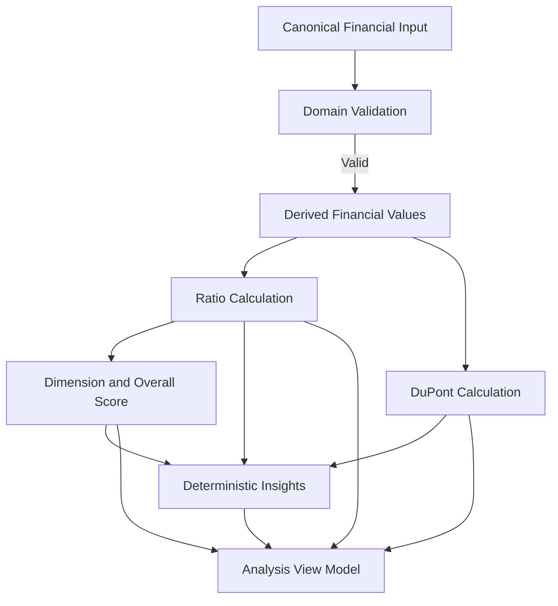
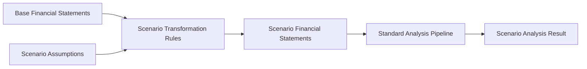

# PRODUCT_REQUIREMENTS_SPECIFICATION.md

# Financial Ratio Analyzer

## Product Requirements Document (PRD)  
## Software Design Specification (SDS)

Version: 1.0  
Status: Approved Baseline  
Document Type: Normative  
Product Stage: MVP  
Deployment Target: Vercel  
Primary Language: English  
Intended Development Time: 22–32 effective hours

---

# 0. Document Authority

This document is the primary source of truth for the Financial Ratio Analyzer project.

If the implementation conflicts with this specification, this document takes precedence unless an explicitly approved decision record states otherwise.

The supporting documents must be interpreted in this order:

1. `PRODUCT_REQUIREMENTS_SPECIFICATION.md`
2. `DESIGN_SYSTEM.md`
3. `VISUAL_DIRECTION.md`
4. `PROJECT_PRINCIPLES.md`
5. `DATASET_SPECIFICATION.md`
6. `CODEX_WORKFLOW.md`

The implementation agent must not silently reinterpret, expand or reduce the approved scope.

Any material deviation must be:

1. identified;
2. justified;
3. documented;
4. approved before implementation.

---

# 1. Executive Summary

Financial Ratio Analyzer is an interactive financial intelligence application for analysing simplified corporate financial statements.

The user enters or loads three reporting periods and receives:

- validated financial statements;
- documented financial ratios;
- financial trend analysis;
- a transparent Financial Health Score;
- profitability, liquidity, solvency, efficiency and cash-flow assessments;
- deterministic strengths and risk insights;
- an interactive DuPont decomposition;
- scenario analysis;
- a print-friendly executive report.

The product also includes an Interactive Analysis Engine Map that explains how raw financial inputs are transformed into decision-ready insights.

The application is designed as a polished portfolio product demonstrating:

- financial analysis;
- corporate finance knowledge;
- product thinking;
- frontend engineering;
- data visualisation;
- deterministic business logic;
- testing;
- documentation;
- software architecture.

---

# 2. Product Vision

## 2.1 Vision statement

> Transform simplified financial statements into transparent, understandable and decision-ready financial insights.

## 2.2 Product promise

The application should enable a user to understand the financial condition of a company without manually calculating, organising or interpreting every ratio.

The product must make the analytical process visible and explainable.

## 2.3 Positioning

Financial Ratio Analyzer is positioned as:

- a financial intelligence application;
- an educational corporate-finance tool;
- a transparent ratio-analysis platform;
- a scenario-analysis environment;
- a portfolio-quality SaaS-style product.

It is not positioned as:

- accounting software;
- audit software;
- a credit-rating model;
- an investment recommendation platform;
- an ERP;
- a regulatory reporting system;
- a replacement for professional judgement.

---

# 3. Product Objectives

## 3.1 Primary objectives

The MVP must:

1. Convert three periods of simplified financial statements into reliable financial ratios.
2. Present the results through an executive and visually coherent interface.
3. Explain why the company receives a particular financial assessment.
4. Enable users to test financial assumptions through scenarios.
5. Demonstrate how the analytical engine works.
6. Remain deterministic, reproducible and independently testable.
7. Be deployable publicly and suitable for presentation on GitHub and LinkedIn.

## 3.2 Secondary objectives

The MVP should:

- demonstrate modular frontend architecture;
- establish a reusable repository standard for future portfolio projects;
- support future extension without requiring an architectural rewrite;
- create reusable financial calculation and visualisation components;
- provide professional project documentation.

## 3.3 Non-objectives

The MVP does not aim to:

- replace professional financial analysis;
- determine creditworthiness;
- value listed securities;
- forecast market prices;
- provide tax, audit or investment advice;
- ingest live financial data;
- support user accounts or collaboration;
- become a general-purpose accounting platform.

---

# 4. Success Criteria

The product is successful when the following conditions are met.

## 4.1 User success

A new user can:

- understand the product within five seconds;
- load a demo company without instructions;
- complete a manual analysis without technical knowledge;
- identify the principal strengths and risks within one minute;
- understand the origin of the Financial Health Score;
- compare a base case with a scenario case;
- access the methodology and formulas;
- export or print the analysis.

## 4.2 Portfolio success

A recruiter should be able to identify:

- the business problem;
- the financial methodology;
- the technology stack;
- the quality of the frontend;
- the modular architecture;
- the testing strategy;
- the project documentation;

within approximately two minutes of opening the repository.

## 4.3 Technical success

The implementation must satisfy:

- successful production build;
- successful lint execution;
- successful automated tests;
- no TypeScript errors;
- no hydration errors;
- no uncaught runtime errors;
- no `NaN` or `Infinity` displayed;
- responsive behaviour from 320px upward;
- keyboard-accessible core workflows;
- public deployment compatible with Vercel.

## 4.4 Scope success

The completed MVP must remain achievable within approximately 22–32 effective development hours.

Features that threaten this constraint must be deferred unless they are required for correctness or acceptance.

---

# 5. Target Users

## 5.1 Primary persona — Junior Financial Analyst

### Context

A student, graduate or junior analyst learning how financial statements connect to business performance.

### Goals

- calculate ratios correctly;
- understand financial trends;
- identify risks;
- practise scenario analysis;
- explain results clearly.

### Needs

- transparent formulas;
- understandable terminology;
- visual interpretation;
- examples;
- methodological explanations.

### Frustrations

- disconnected spreadsheet calculations;
- ratios shown without context;
- unclear thresholds;
- black-box scores;
- excessive financial jargon.

---

## 5.2 Secondary persona — Business or Finance Recruiter

### Context

A recruiter reviewing the creator's analytical and technical capabilities.

### Goals

- understand the project's purpose quickly;
- assess the quality of execution;
- identify relevant competencies;
- see a complete, deployed product.

### Needs

- professional landing page;
- concise value proposition;
- visible outputs;
- coherent documentation;
- high-quality screenshots;
- direct access to the live application and repository.

---

## 5.3 Secondary persona — Business Student or Non-specialist Manager

### Context

A user with basic financial knowledge who wants an overview rather than an accounting system.

### Goals

- understand whether a company appears financially healthy;
- identify major strengths and risks;
- understand how decisions affect ratios.

### Needs

- plain-language explanations;
- contextual tooltips;
- progressive disclosure;
- visual summaries;
- clear disclaimers.

---

## 5.4 Technical reviewer

### Context

A frontend developer, data professional or technical recruiter reviewing implementation quality.

### Goals

- inspect architecture;
- verify financial logic separation;
- evaluate testing;
- assess maintainability;
- understand design decisions.

### Needs

- modular repository structure;
- pure functions;
- typed domain models;
- documentation;
- meaningful commit history;
- explicit limitations.

---

# 6. Primary User Journey



---

# 7. Product Journey and State Flow



---

# 8. Information Architecture

The MVP contains five primary product areas.

```text
Landing
├── Hero
├── Interactive Analysis Engine Map
├── Product Preview
├── Main Capabilities
└── Methodology Preview

Financial Input
├── Company Context
├── Income Statement
├── Balance Sheet
├── Cash Flow
├── Working Capital
└── Validation Summary

Executive Dashboard
├── Financial Health Score
├── KPI Summary
├── Financial Dimensions
├── Trend Analysis
├── Strengths and Risks
└── Detailed Ratios

DuPont Analysis
├── ROE Decomposition
├── Component Trends
└── Driver Explanation

Scenario Lab
├── Assumption Controls
├── Base Case
├── Scenario Case
├── Score Impact
└── Updated Insights

Methodology
├── Formula Catalogue
├── Scoring Method
├── Thresholds
├── Assumptions
├── Limitations
└── Disclaimer
```

No additional primary product area may be introduced during the MVP without approval.

---

# 9. Navigation Requirements

## 9.1 Primary navigation

The authenticated-style application shell must contain:

- Overview
- Financial Input
- Ratio Analysis
- DuPont Analysis
- Scenario Lab
- Methodology

Authentication is not included; the term “application shell” refers only to the visual structure.

## 9.2 Navigation behaviour

The interface must:

- highlight the current location;
- preserve the loaded dataset during navigation;
- avoid full-page reloads;
- support keyboard navigation;
- expose textual labels alongside icons;
- provide a mobile drawer or equivalent compact navigation.

## 9.3 Route expectations

Suggested routes:

```text
/
 /input
 /analysis
 /analysis/ratios
 /analysis/dupont
 /scenario
 /methodology
```

The final route design may differ if a simpler App Router structure improves implementation without reducing clarity.

---

# 10. Functional Requirements

Requirements use the following identifiers:

- `FR-LAN`: Landing
- `FR-INP`: Financial input
- `FR-VAL`: Validation
- `FR-CAL`: Calculation engine
- `FR-SCO`: Scoring
- `FR-INS`: Insights
- `FR-DAS`: Dashboard
- `FR-DUP`: DuPont
- `FR-SCN`: Scenario Lab
- `FR-MAP`: Engine Map
- `FR-EXP`: Export and reporting
- `FR-MET`: Methodology

---

# 11. Landing Page Requirements

## FR-LAN-001 — Value proposition

The landing page shall display a clear product headline and supporting description.

Suggested headline:

> Understand a company's financial health in minutes.

## FR-LAN-002 — Primary actions

The landing page shall provide:

- `Start Analysis`
- `Load Demo Company`

The primary action must be visually dominant.

## FR-LAN-003 — Product preview

The landing page shall contain a visual preview of the actual dashboard.

The preview must not rely on an unrelated generic mockup.

## FR-LAN-004 — Capability summary

The landing page shall explain the principal capabilities:

- financial analysis;
- ratio intelligence;
- health scoring;
- deterministic insights;
- DuPont analysis;
- scenario modelling.

## FR-LAN-005 — Methodology access

The landing page shall provide direct access to the methodology.

## FR-LAN-006 — Responsive landing

The landing page shall remain fully usable from 320px upward.

---

# 12. Financial Input Requirements

## FR-INP-001 — Company context

The user shall be able to define:

- company name;
- industry;
- currency;
- three reporting years.

## FR-INP-002 — Supported periods

The MVP shall support exactly three annual reporting periods per analysis.

Quarterly input is outside scope.

## FR-INP-003 — Income statement fields

For each period, the application shall support:

- Revenue
- Cost of Goods Sold
- EBIT
- Interest Expense
- Net Income

The canonical dataset may include additional derived or demo fields where defined in `DATASET_SPECIFICATION.md`.

## FR-INP-004 — Balance-sheet fields

For each period, the application shall support:

- Cash
- Accounts Receivable
- Inventory
- Current Assets
- Total Assets
- Current Liabilities
- Total Debt
- Equity

## FR-INP-005 — Cash-flow fields

For each period, the application shall support:

- Operating Cash Flow
- Capital Expenditure

## FR-INP-006 — Efficiency fields

For each period, the application shall support:

- Average Inventory
- Average Receivables
- Average Payables

## FR-INP-007 — Input structure

The input experience shall be organised as a guided financial workflow rather than a spreadsheet grid.

Sections shall include:

1. Company context
2. Income statement
3. Balance sheet
4. Cash flow
5. Working capital
6. Validation review

## FR-INP-008 — Demo companies

The user shall be able to load:

- NovaTech Solutions
- Atlas Manufacturing Group

Demo data must comply with `DATASET_SPECIFICATION.md`.

## FR-INP-009 — Data editing

Loaded demo data shall remain editable.

## FR-INP-010 — Data persistence

The application may preserve the active analysis during the current browser session.

Persistent user storage, accounts and cloud synchronisation are outside scope.

## FR-INP-011 — Numeric entry

Inputs shall:

- accept valid decimal values;
- support negative values where financially meaningful;
- reject invalid text;
- display currency or percentage context where appropriate;
- avoid silently changing user values.

## FR-INP-012 — Submission

The user shall only proceed to analysis when blocking validation requirements are satisfied.

---

# 13. Validation Requirements

## FR-VAL-001 — Required fields

The application shall identify missing mandatory fields.

## FR-VAL-002 — Type validation

All financial inputs shall be validated as finite numeric values.

## FR-VAL-003 — Division safety

The application shall detect inputs that would create invalid ratio denominators.

Invalid denominators must produce an unavailable ratio state rather than `Infinity` or `NaN`.

## FR-VAL-004 — Accounting equation

When sufficient data is available, the system shall evaluate whether:

> Total Assets = Total Liabilities + Equity

If the minimum MVP input does not expose total liabilities separately, the equation must be checked using a documented derivation or shown only for demo datasets that contain the required detail.

The application must not pretend to validate an equation for which sufficient inputs do not exist.

## FR-VAL-005 — Consistency warnings

The system should identify:

- current assets greater than total assets;
- inventory greater than current assets;
- cash greater than current assets;
- receivables greater than current assets;
- current liabilities inconsistent with debt structure;
- reporting years that are duplicated or not chronological;
- unusually extreme financial values.

## FR-VAL-006 — Warning severity

Validation findings shall be classified as:

- Blocking error
- Warning
- Informational notice

## FR-VAL-007 — Human-readable feedback

Validation feedback shall explain:

- what is wrong;
- where it occurred;
- how to correct it.

## FR-VAL-008 — Unusual but valid data

The application shall allow financially unusual values when calculations remain valid.

Warnings must not automatically block analysis.

---

# 14. Financial Calculation Requirements

## FR-CAL-001 — Deterministic calculations

All financial calculations shall be deterministic.

The same valid dataset must always produce the same results.

## FR-CAL-002 — Pure functions

Financial formulas shall be implemented as pure, independently testable functions.

## FR-CAL-003 — Profitability ratios

The calculation engine shall support:

- Gross Margin
- EBIT Margin
- Net Margin
- Return on Assets
- Return on Equity
- Return on Capital Employed

## FR-CAL-004 — Liquidity ratios

The calculation engine shall support:

- Current Ratio
- Quick Ratio
- Cash Ratio
- Operating Cash Flow Ratio

## FR-CAL-005 — Solvency ratios

The calculation engine shall support:

- Debt-to-Equity
- Debt-to-Assets
- Equity Ratio
- Interest Coverage

## FR-CAL-006 — Efficiency ratios

The calculation engine shall support:

- Asset Turnover
- Inventory Turnover
- Receivables Turnover
- Days Sales Outstanding
- Days Inventory Outstanding
- Days Payables Outstanding
- Cash Conversion Cycle

## FR-CAL-007 — Cash-flow metrics

The calculation engine shall support:

- Operating Cash Flow Margin
- Free Cash Flow
- Free Cash Flow Margin
- Operating Cash Flow to Net Income

## FR-CAL-008 — Formula documentation

Every formula shall be documented with:

- name;
- mathematical expression;
- inputs;
- interpretation;
- edge cases;
- unavailable conditions.

## FR-CAL-009 — Average balance convention

Ratios that conventionally use average balance-sheet values should use:

- explicit average inputs where provided; or
- average opening and closing values where sufficient data exists.

The chosen convention must be consistent and documented.

## FR-CAL-010 — Unavailable state

When a ratio cannot be meaningfully calculated, return a typed unavailable result containing:

- status;
- reason;
- optional affected denominator.

Do not substitute zero unless zero is the genuine financial result.

## FR-CAL-011 — Precision

Calculations should preserve sufficient internal precision.

Rounding shall occur at the presentation layer.

---

# 15. Financial Health Score Requirements

## FR-SCO-001 — Score range

The Financial Health Score shall range from 0 to 100.

## FR-SCO-002 — Dimensions

The score shall contain:

- Profitability
- Liquidity
- Solvency
- Efficiency
- Cash Flow

## FR-SCO-003 — Weights

The initial weights shall be:

| Dimension | Weight |
|---|---:|
| Profitability | 25% |
| Liquidity | 20% |
| Solvency | 20% |
| Efficiency | 15% |
| Cash Flow | 20% |

## FR-SCO-004 — Classification

The overall score shall map to:

| Score | Classification |
|---|---|
| 80–100 | Strong |
| 65–79 | Healthy |
| 50–64 | Moderate |
| 35–49 | Weak |
| 0–34 | Critical |

## FR-SCO-005 — Configurable thresholds

Metric thresholds shall be stored separately from scoring functions.

## FR-SCO-006 — Missing ratios

Missing ratios must not silently receive a score of zero.

The scoring engine shall use a documented missing-data policy.

Recommended MVP policy:

- exclude unavailable metrics from the relevant dimension;
- reweight the remaining valid metrics within that dimension;
- mark the dimension as unavailable when insufficient valid metrics remain;
- disclose reduced analytical coverage.

## FR-SCO-007 — Driver explanation

The score output shall identify:

- strongest dimension;
- weakest dimension;
- principal positive drivers;
- principal negative drivers.

## FR-SCO-008 — Period comparison

The dashboard shall show score change relative to the preceding period when comparable data exists.

## FR-SCO-009 — Disclaimer

The score must display or link to the statement:

> The Financial Health Score is an educational analytical indicator based on configurable thresholds. It is not a credit rating, investment recommendation, audit opinion or substitute for professional financial analysis.

---

# 16. Deterministic Insight Requirements

## FR-INS-001 — Rules-based generation

Insights shall be generated through transparent deterministic rules.

Generative AI shall not be used in the MVP.

## FR-INS-002 — Insight categories

Insights shall include:

- Strength
- Risk
- Informational observation

The executive dashboard may prioritise only strengths and risks.

## FR-INS-003 — Insight structure

Each insight shall contain:

- identifier;
- title;
- category;
- severity;
- explanation;
- supporting metric or calculation;
- affected period;
- trend direction where applicable.

## FR-INS-004 — Supported insight patterns

The engine should identify:

- improving or declining margins;
- strong or weak liquidity;
- increasing or decreasing leverage;
- strong or weak interest coverage;
- deteriorating working-capital efficiency;
- positive earnings unsupported by operating cash flow;
- negative free cash flow;
- ROE driven disproportionately by leverage;
- improving or deteriorating health score.

## FR-INS-005 — Prioritisation

Insights shall be ranked by:

1. severity;
2. financial materiality;
3. recency;
4. relevance to the total score.

## FR-INS-006 — Display limit

The executive dashboard shall display no more than:

- three principal strengths;
- three principal risks.

Detailed analysis may expose additional observations.

## FR-INS-007 — Reproducibility

The same dataset and configuration must produce the same insights in the same priority order.

---

# 17. Executive Dashboard Requirements

## FR-DAS-001 — Executive overview

The dashboard shall provide a high-level assessment that can be understood within approximately 30 seconds.

## FR-DAS-002 — Context

The dashboard shall display:

- company name;
- industry;
- currency;
- active reporting period;
- comparison period.

## FR-DAS-003 — Principal KPIs

The dashboard should prioritise:

- Financial Health Score
- ROE
- Current Ratio
- Debt-to-Equity
- Free Cash Flow
- Net Margin

## FR-DAS-004 — Financial dimensions

The dashboard shall show the five dimension scores.

## FR-DAS-005 — Radar visualisation

A radar chart shall compare:

- Profitability
- Liquidity
- Solvency
- Efficiency
- Cash Flow

## FR-DAS-006 — Trend analysis

The dashboard shall provide selectable ratio trends across the three periods.

## FR-DAS-007 — Profitability waterfall

The interface should provide a waterfall or equivalent structured visual explaining the path from revenue to net income when the available data supports a valid reconciliation.

## FR-DAS-008 — Working-capital cycle

The dashboard shall explain:

> DIO + DSO − DPO = Cash Conversion Cycle

## FR-DAS-009 — Insights

The dashboard shall display principal strengths and risks.

## FR-DAS-010 — Detailed ratios

Users shall be able to review all calculated ratios grouped by financial dimension.

Each ratio shall expose:

- current value;
- prior-period value;
- direction;
- formula;
- short interpretation;
- availability status.

## FR-DAS-011 — Responsive behaviour

On smaller screens:

- sections shall stack vertically;
- chart labels shall remain readable;
- dense tables may use local horizontal scrolling;
- analytical priority shall be preserved.

---

# 18. DuPont Requirements

## FR-DUP-001 — DuPont identity

The MVP shall implement the three-step DuPont model:

> ROE = Net Profit Margin × Asset Turnover × Financial Leverage

## FR-DUP-002 — Component display

The interface shall display:

- ROE
- Net Profit Margin
- Asset Turnover
- Financial Leverage

## FR-DUP-003 — Driver interpretation

The interface shall explain which component contributes most strongly to ROE.

## FR-DUP-004 — Leverage warning

When elevated ROE is substantially driven by leverage, the insight engine should identify this condition.

## FR-DUP-005 — Period comparison

DuPont components shall be comparable across the three periods.

## FR-DUP-006 — Scenario integration

Scenario changes affecting relevant inputs shall update the DuPont decomposition immediately.

---

# 19. Scenario Lab Requirements

## FR-SCN-001 — Base case preservation

The original analysis shall remain visible and unchanged while a scenario is active.

## FR-SCN-002 — Adjustable assumptions

The MVP shall allow adjustment of:

- revenue growth;
- EBIT margin;
- total debt;
- current assets;
- inventory;
- interest expense.

## FR-SCN-003 — Preset scenarios

Where consistent with the data specification, the application should provide:

- High Growth
- Economic Slowdown
- Debt Reduction
- Inventory Optimisation
- Higher Interest Rates

## FR-SCN-004 — Immediate recalculation

Scenario changes shall update outputs without requiring a page reload or manual calculate action.

## FR-SCN-005 — Consistent propagation

A scenario shall modify all financially dependent fields according to explicit and documented rules.

The implementation must not alter isolated ratios directly.

## FR-SCN-006 — Comparison

For affected metrics, the interface shall show:

- base value;
- scenario value;
- absolute change;
- percentage change;
- direction;
- impact on score.

## FR-SCN-007 — Updated insights

The deterministic insight engine shall evaluate the scenario case separately.

## FR-SCN-008 — Reset

The user shall be able to restore the complete base case.

## FR-SCN-009 — Invalid scenarios

The system shall prevent or clearly explain scenarios that create structurally impossible financial data.

---

# 20. Interactive Analysis Engine Map Requirements

## FR-MAP-001 — Purpose

The landing page shall contain an interactive visualisation explaining the analytical pipeline.

## FR-MAP-002 — Stages

The map shall represent:

1. Financial Input
2. Validation and Normalisation
3. Financial Calculation Engine
4. Ratio Intelligence
5. Financial Health Scoring
6. Deterministic Insight Engine
7. Decision Interface and Scenario Analysis

## FR-MAP-003 — Business view

The map shall provide user-facing labels such as:

- Enter Data
- Validate
- Calculate
- Evaluate
- Explain
- Explore
- Simulate

## FR-MAP-004 — Technical view

The map shall expose relevant implementation layers, including:

- React Hook Form
- Zod
- pure TypeScript financial functions
- scoring configuration
- deterministic insight rules
- ECharts presentation components
- scenario state and recalculation

## FR-MAP-005 — Node details

Each node shall expose:

- purpose;
- inputs;
- outputs;
- technical layer.

## FR-MAP-006 — Guided tour

The user shall be able to trigger a short guided walkthrough.

It shall be:

- optional;
- skippable;
- approximately 8–12 seconds;
- compatible with reduced-motion preferences.

## FR-MAP-007 — Responsive presentation

The map shall use:

- horizontal flow on suitable desktop widths;
- vertical flow on mobile;
- readable static fallback when animation is unavailable.

## FR-MAP-008 — Technology

The map shall use:

- React;
- SVG;
- Tailwind CSS;
- Framer Motion.

It shall not use:

- ECharts;
- generic flowchart libraries;
- heavy graph-layout libraries;
- 3D canvas;
- decorative particle systems.

---

# 21. Methodology Requirements

## FR-MET-001 — Formula catalogue

The application shall provide access to every implemented formula.

## FR-MET-002 — Scoring explanation

The methodology shall explain:

- dimensions;
- weights;
- metric thresholds;
- classification;
- missing-data handling.

## FR-MET-003 — Insight explanation

The methodology shall disclose that insights are deterministic and rules-based.

## FR-MET-004 — Limitations

The methodology shall state key limitations, including:

- simplified financial statements;
- configurable rather than authoritative benchmarks;
- educational score;
- no external audit;
- no sector-specific professional conclusion;
- no investment recommendation.

## FR-MET-005 — Data source disclosure

Demo-company data shall be identified as fictional and internally constructed for analytical demonstration.

---

# 22. Export and Reporting Requirements

## FR-EXP-001 — Print layout

The dashboard shall provide a print-friendly presentation.

## FR-EXP-002 — Browser PDF

The interface shall support saving the report as PDF through the browser print workflow.

A bespoke PDF-generation backend is outside scope.

## FR-EXP-003 — Executive summary

The user shall be able to select and copy the deterministic executive summary using standard browser interaction.

No permission-gated clipboard integration is required.

## FR-EXP-004 — Print exclusions

The print view should exclude:

- interactive navigation;
- unnecessary controls;
- hover-only content;
- scenario sliders unless materially relevant.

## FR-EXP-005 — Print content

The printed report should include:

- company context;
- Financial Health Score;
- key ratios;
- dimension scores;
- principal strengths and risks;
- DuPont analysis;
- active scenario comparison where applicable;
- methodology disclaimer.

---

# 23. Global Functional Acceptance Criteria

The functional MVP is accepted when:

1. A user can load either demo company.
2. A user can enter three periods manually.
3. Invalid inputs produce clear validation feedback.
4. The calculation engine produces the documented ratios.
5. No invalid numeric value is shown.
6. The Financial Health Score is deterministic and explainable.
7. Strengths and risks reflect the analysed data.
8. The dashboard visualises the three periods.
9. DuPont analysis is mathematically correct.
10. Scenario changes recalculate affected outputs.
11. The Engine Map explains the analytical pipeline.
12. The methodology documents formulas and limitations.
13. The report can be printed.
14. Core interactions work on desktop and mobile.
15. The application remains within the approved MVP scope.

---

# End of PRD Section

Next section:

---

# 24. Software Design Specification

## 24.1 Purpose

This section defines how the Financial Ratio Analyzer shall be implemented.

Its objectives are to:

- separate financial logic from presentation;
- create a predictable data flow;
- keep calculations deterministic;
- support independent testing;
- preserve the approved MVP scope;
- make the repository understandable to future contributors;
- provide Codex with explicit architectural boundaries.

The architecture must favour clarity and maintainability over unnecessary abstraction.

---

# 25. Technical Architecture

## 25.1 Architecture style

The MVP shall use a frontend-only modular architecture.



## 25.2 Runtime model

The application shall execute financial analysis locally in the browser.

The MVP shall not require:

- a backend;
- a database;
- server-side financial calculations;
- external analytical APIs;
- user authentication;
- external AI services.

Next.js server capabilities may be used only where they improve static rendering, metadata or build behaviour without introducing unnecessary infrastructure.

## 25.3 Primary technologies

| Responsibility | Technology |
|---|---|
| Application framework | Next.js App Router |
| Language | TypeScript in strict mode |
| Styling | Tailwind CSS |
| UI primitives | shadcn/ui |
| Financial charts | Apache ECharts |
| Architecture map | React + SVG + Framer Motion |
| Forms | React Hook Form |
| Validation | Zod |
| Unit testing | Vitest |
| Component testing | Testing Library where justified |
| Deployment | Vercel |

## 25.4 Dependency constraint

A new dependency may only be introduced when:

1. the capability is required by the approved specification;
2. implementing it internally would create disproportionate complexity;
3. the package is actively maintained;
4. the package is compatible with the selected stack;
5. the dependency does not duplicate an existing capability.

---

# 26. Architectural Principles

The implementation shall follow these principles.

## 26.1 Domain independence

Financial formulas, score calculations and insight rules must not depend on:

- React;
- ECharts;
- browser APIs;
- component state;
- CSS;
- route structure.

## 26.2 Presentation independence

Charts and components shall consume prepared analytical outputs.

They must not independently calculate financial ratios.

## 26.3 Configuration over hard-coding

The following shall exist as configuration:

- score weights;
- ratio thresholds;
- score classifications;
- insight-rule thresholds;
- demo-company definitions;
- Engine Map node content;
- formatting conventions where appropriate.

## 26.4 Single canonical model

The application shall use one canonical financial data structure.

Alternative shapes must be converted into the canonical domain model before analysis.

## 26.5 Deterministic execution

No core analytical output may depend on:

- random values;
- network availability;
- generative AI;
- system time, except for non-analytical metadata;
- rendering order.

---

# 27. High-Level Module Architecture

```text
src/
├── app/
├── components/
├── features/
├── domain/
├── data/
├── config/
├── lib/
├── types/
└── tests/
```

## 27.1 `app/`

Responsible for:

- routes;
- layouts;
- metadata;
- page composition;
- route-level error boundaries;
- print styles where route-specific.

It must not contain financial formulas.

## 27.2 `components/`

Responsible for reusable visual elements:

- UI primitives;
- navigation;
- charts;
- dashboard sections;
- forms;
- Engine Map;
- shared feedback states.

## 27.3 `features/`

Responsible for product workflows:

- financial input;
- analysis;
- scoring presentation;
- insights presentation;
- DuPont;
- scenarios;
- reporting.

## 27.4 `domain/`

Responsible for financial business logic:

- canonical financial model;
- formulas;
- ratio calculations;
- scoring;
- deterministic insights;
- scenario propagation;
- analytical coverage.

This directory is the core of the product.

## 27.5 `data/`

Responsible for:

- fictional demo companies;
- preset scenarios;
- static methodology content where appropriate.

## 27.6 `config/`

Responsible for:

- scoring weights;
- thresholds;
- classifications;
- insight priorities;
- chart categories;
- Engine Map configuration.

## 27.7 `lib/`

Responsible for generic utilities:

- number formatting;
- currency formatting;
- percentage formatting;
- safe arithmetic helpers;
- export helpers;
- browser-session helpers.

Generic utilities must not contain domain rules.

---

# 28. Recommended Repository Structure

```text
financial-ratio-analyzer/
├── public/
│   ├── images/
│   ├── examples/
│   └── icons/
├── assets/
│   ├── repository-banner.svg
│   └── screenshots/
├── docs/
│   ├── PRODUCT_REQUIREMENTS_SPECIFICATION.md
│   ├── DESIGN_SYSTEM.md
│   ├── VISUAL_DIRECTION.md
│   ├── PROJECT_PRINCIPLES.md
│   ├── DATASET_SPECIFICATION.md
│   ├── CODEX_WORKFLOW.md
│   ├── formulas.md
│   └── methodology.md
├── src/
│   ├── app/
│   │   ├── page.tsx
│   │   ├── input/
│   │   │   └── page.tsx
│   │   ├── analysis/
│   │   │   ├── page.tsx
│   │   │   ├── ratios/
│   │   │   │   └── page.tsx
│   │   │   └── dupont/
│   │   │       └── page.tsx
│   │   ├── scenario/
│   │   │   └── page.tsx
│   │   ├── methodology/
│   │   │   └── page.tsx
│   │   ├── layout.tsx
│   │   ├── error.tsx
│   │   └── not-found.tsx
│   ├── components/
│   │   ├── ui/
│   │   ├── layout/
│   │   ├── charts/
│   │   ├── dashboard/
│   │   ├── forms/
│   │   ├── engine-map/
│   │   ├── scenarios/
│   │   └── feedback/
│   ├── features/
│   │   ├── financial-input/
│   │   ├── analysis/
│   │   ├── ratios/
│   │   ├── scoring/
│   │   ├── insights/
│   │   ├── dupont/
│   │   ├── scenarios/
│   │   └── reporting/
│   ├── domain/
│   │   ├── financial-model/
│   │   ├── ratios/
│   │   ├── scoring/
│   │   ├── insights/
│   │   ├── scenarios/
│   │   └── validation/
│   ├── data/
│   │   ├── demo-companies.ts
│   │   └── preset-scenarios.ts
│   ├── config/
│   │   ├── scoring.ts
│   │   ├── thresholds.ts
│   │   ├── classifications.ts
│   │   ├── insight-rules.ts
│   │   └── engine-map.ts
│   ├── lib/
│   │   ├── formatting.ts
│   │   ├── safe-math.ts
│   │   ├── storage.ts
│   │   └── print.ts
│   ├── types/
│   └── tests/
├── README.md
├── LICENSE
├── package.json
├── tsconfig.json
├── vitest.config.ts
└── next.config.ts
```

Codex may simplify this structure when two folders would contain only trivial files, but must preserve responsibility boundaries.

---

# 29. Financial Domain Model

## 29.1 Company model

```ts
type CurrencyCode = "EUR" | "USD" | "GBP";

interface CompanyProfile {
  id: string;
  name: string;
  industry: string;
  currency: CurrencyCode;
}
```

The MVP interface may initially expose only EUR if supporting multiple currencies would increase implementation effort disproportionately.

The domain model should remain compatible with other currency codes.

## 29.2 Reporting period

```ts
type ReportingYear = number;

interface FinancialPeriod {
  year: ReportingYear;
  incomeStatement: IncomeStatement;
  balanceSheet: BalanceSheet;
  cashFlow: CashFlowStatement;
  workingCapital: WorkingCapitalInputs;
}
```

## 29.3 Income statement

```ts
interface IncomeStatement {
  revenue: number;
  costOfGoodsSold: number;
  ebit: number;
  interestExpense: number;
  netIncome: number;
}
```

Demo datasets may additionally contain:

```ts
interface ExtendedIncomeStatement extends IncomeStatement {
  grossProfit?: number;
  operatingExpenses?: number;
  taxExpense?: number;
}
```

Derived fields must not be required when they can be calculated consistently.

## 29.4 Balance sheet

```ts
interface BalanceSheet {
  cash: number;
  accountsReceivable: number;
  inventory: number;
  currentAssets: number;
  totalAssets: number;
  currentLiabilities: number;
  totalDebt: number;
  equity: number;
}
```

Extended demo data may include:

```ts
interface ExtendedBalanceSheet extends BalanceSheet {
  accountsPayable?: number;
  propertyPlantEquipment?: number;
  longTermDebt?: number;
  totalLiabilities?: number;
}
```

## 29.5 Cash flow

```ts
interface CashFlowStatement {
  operatingCashFlow: number;
  capitalExpenditure: number;
}
```

Extended demo data may include:

```ts
interface ExtendedCashFlowStatement extends CashFlowStatement {
  investingCashFlow?: number;
  financingCashFlow?: number;
  netChangeInCash?: number;
}
```

## 29.6 Working-capital inputs

```ts
interface WorkingCapitalInputs {
  averageInventory: number;
  averageReceivables: number;
  averagePayables: number;
}
```

## 29.7 Canonical analysis input

```ts
interface FinancialAnalysisInput {
  company: CompanyProfile;
  periods: [FinancialPeriod, FinancialPeriod, FinancialPeriod];
}
```

Runtime validation must confirm that:

- exactly three periods exist;
- years are unique;
- years are chronological;
- every value is finite;
- the object complies with the Zod schema.

---

# 30. Financial Result Types

## 30.1 Ratio status

```ts
type MetricStatus = "available" | "unavailable";
```

## 30.2 Available metric

```ts
interface AvailableMetric {
  status: "available";
  value: number;
}
```

## 30.3 Unavailable metric

```ts
interface UnavailableMetric {
  status: "unavailable";
  reason:
    | "missing-input"
    | "zero-denominator"
    | "non-meaningful-denominator"
    | "insufficient-history"
    | "invalid-financial-relationship";
}
```

## 30.4 Metric result

```ts
type MetricResult = AvailableMetric | UnavailableMetric;
```

The UI must explicitly render unavailable states.

It must not display unavailable metrics as zero.

## 30.5 Ratio definition

```ts
type RatioCategory =
  | "profitability"
  | "liquidity"
  | "solvency"
  | "efficiency"
  | "cash-flow";

interface RatioDefinition {
  id: string;
  name: string;
  shortName: string;
  category: RatioCategory;
  unit: "percentage" | "multiple" | "days" | "currency";
  description: string;
  formulaLabel: string;
}
```

## 30.6 Period ratio output

```ts
interface PeriodRatioResult {
  year: ReportingYear;
  ratios: Record<string, MetricResult>;
}
```

---

# 31. Calculation Pipeline



## 31.1 Pipeline rule

Every analytical result shall be generated from the canonical input.

Components must not bypass this pipeline.

## 31.2 Calculation orchestration

A single orchestration function should expose the full analysis.

Example:

```ts
function analyseFinancialStatements(
  input: FinancialAnalysisInput,
  configuration: AnalysisConfiguration
): FinancialAnalysisResult;
```

## 31.3 Result contract

```ts
interface FinancialAnalysisResult {
  company: CompanyProfile;
  periods: PeriodAnalysis[];
  currentPeriod: PeriodAnalysis;
  previousPeriod?: PeriodAnalysis;
  score: FinancialHealthScore;
  insights: FinancialInsight[];
  coverage: AnalyticalCoverage;
}
```

---

# 32. Derived Financial Values

Derived values should be computed once and reused.

Examples include:

- gross profit;
- quick assets;
- working capital;
- capital employed;
- free cash flow;
- financial leverage;
- average total assets where possible.

```ts
interface DerivedFinancialValues {
  grossProfit: MetricResult;
  quickAssets: MetricResult;
  workingCapital: MetricResult;
  capitalEmployed: MetricResult;
  freeCashFlow: MetricResult;
  financialLeverage: MetricResult;
}
```

Derived values shall not be duplicated across formula functions.

---

# 33. Formula Engine Design

## 33.1 Formula characteristics

Each formula function shall:

- receive explicit inputs;
- return `MetricResult`;
- contain no presentation formatting;
- contain no mutable state;
- contain no side effects;
- avoid throwing for expected financial edge cases.

## 33.2 Safe division

A shared helper shall control division.

```ts
function safeDivide(
  numerator: number,
  denominator: number,
  options?: SafeDivisionOptions
): MetricResult;
```

The helper must distinguish between:

- genuine zero result;
- invalid zero denominator;
- financially non-meaningful denominator;
- missing input.

## 33.3 Formula registry

The application should maintain a registry connecting:

- formula identifier;
- calculation function;
- metadata;
- category;
- display unit;
- score eligibility.

This prevents formula metadata from being repeated in components.

---

# 34. Scoring Engine Design

## 34.1 Configuration types

```ts
interface ScoreWeights {
  profitability: number;
  liquidity: number;
  solvency: number;
  efficiency: number;
  cashFlow: number;
}
```

The weights must total 1.0.

## 34.2 Metric threshold model

```ts
type ThresholdDirection =
  | "higher-is-better"
  | "lower-is-better"
  | "target-range";

interface MetricThreshold {
  metricId: string;
  direction: ThresholdDirection;
  bands: ScoreBand[];
}
```

## 34.3 Score band

```ts
interface ScoreBand {
  min?: number;
  max?: number;
  score: number;
  label?: string;
}
```

## 34.4 Dimension score

```ts
interface DimensionScore {
  dimension: RatioCategory;
  score: number | null;
  validMetricCount: number;
  configuredMetricCount: number;
  coveragePercentage: number;
  strongestMetrics: string[];
  weakestMetrics: string[];
}
```

## 34.5 Overall score

```ts
interface FinancialHealthScore {
  total: number | null;
  classification:
    | "Strong"
    | "Healthy"
    | "Moderate"
    | "Weak"
    | "Critical"
    | "Unavailable";
  dimensions: DimensionScore[];
  changeFromPreviousPeriod: number | null;
  coveragePercentage: number;
}
```

## 34.6 Missing-data policy

The scoring engine shall:

1. calculate only valid eligible metrics;
2. reweight valid metrics inside a dimension;
3. mark a dimension unavailable when coverage is below a configured minimum;
4. reweight available dimensions only when sufficient total coverage remains;
5. expose the resulting coverage percentage;
6. avoid presenting a confident score when analytical coverage is materially insufficient.

The minimum acceptable coverage shall be defined in configuration.

---

# 35. Insight Engine Design

## 35.1 Insight type

```ts
type InsightCategory = "strength" | "risk" | "observation";
type InsightSeverity = "low" | "medium" | "high";
type TrendDirection = "improving" | "deteriorating" | "stable" | "mixed";

interface FinancialInsight {
  id: string;
  ruleId: string;
  title: string;
  category: InsightCategory;
  severity: InsightSeverity;
  explanation: string;
  supportingMetricIds: string[];
  affectedYear: ReportingYear;
  trend: TrendDirection;
  priority: number;
}
```

## 35.2 Rule contract

```ts
interface InsightRule {
  id: string;
  evaluate(context: InsightContext): FinancialInsight | null;
}
```

## 35.3 Rule organisation

Rules should be grouped by:

- profitability;
- liquidity;
- solvency;
- efficiency;
- cash flow;
- DuPont;
- cross-metric contradiction;
- total score.

## 35.4 Priority calculation

Priority may consider:

- severity;
- relative change;
- threshold distance;
- recency;
- score contribution.

The final sort order must remain deterministic.

## 35.5 Insight wording

Insight text shall:

- use plain financial language;
- cite the relevant metric;
- avoid unsupported conclusions;
- avoid definitive professional recommendations;
- avoid generic filler text.

---

# 36. DuPont Engine Design

## 36.1 Result type

```ts
interface DuPontResult {
  year: ReportingYear;
  roe: MetricResult;
  netProfitMargin: MetricResult;
  assetTurnover: MetricResult;
  financialLeverage: MetricResult;
  reconciliationStatus:
    | "reconciled"
    | "approximate"
    | "unavailable";
}
```

## 36.2 Reconciliation

Where ratios are available:

> ROE ≈ Net Profit Margin × Asset Turnover × Financial Leverage

Minor differences caused by average-balance conventions or rounding must be explained.

Internal calculations must use unrounded values.

## 36.3 Driver analysis

The DuPont module shall identify:

- strongest positive driver;
- weakest driver;
- material leverage dependency;
- period-over-period driver changes.

---

# 37. Scenario Engine Design

## 37.1 Scenario principle

The Scenario Engine shall transform financial statements.

It must not directly modify ratio outputs or score results.



## 37.2 Scenario assumptions

```ts
interface ScenarioAssumptions {
  revenueGrowthPercent: number;
  ebitMarginPercent?: number;
  totalDebtChangePercent: number;
  currentAssetsChangePercent: number;
  inventoryChangePercent: number;
  interestExpenseChangePercent: number;
}
```

## 37.3 Scenario result

```ts
interface ScenarioAnalysis {
  id: string;
  name: string;
  assumptions: ScenarioAssumptions;
  transformedInput: FinancialAnalysisInput;
  analysis: FinancialAnalysisResult;
  comparison: ScenarioComparison;
}
```

## 37.4 Propagation rules

Every scenario transformation must document:

- source field;
- transformation;
- dependent fields;
- balancing assumption;
- limitation.

For example, reducing inventory must not automatically imply an identical increase in cash unless the selected scenario rule explicitly states that assumption.

## 37.5 Base-case immutability

Scenario transformations shall create a new financial object.

They must never mutate the base input.

---

# 38. Validation Architecture

## 38.1 Validation layers

Validation shall occur at three levels.

### Schema validation

Checks:

- object shape;
- required fields;
- finite numbers;
- exact period count;
- valid years.

### Financial relationship validation

Checks:

- internal relationships;
- accounting consistency;
- structurally impossible values.

### Analytical validation

Checks:

- ratio denominator suitability;
- insufficient history;
- incomplete extended data;
- reduced score coverage.

## 38.2 Validation result

```ts
type ValidationSeverity = "error" | "warning" | "info";

interface ValidationIssue {
  id: string;
  path: string;
  severity: ValidationSeverity;
  message: string;
  suggestion?: string;
  year?: ReportingYear;
}
```

## 38.3 Validation summary

```ts
interface ValidationResult {
  valid: boolean;
  issues: ValidationIssue[];
  blockingIssueCount: number;
  warningCount: number;
}
```

## 38.4 Blocking policy

Only `error` issues shall block analysis.

Warnings and informational findings must remain visible but shall allow continuation.

---

# 39. State Management

## 39.1 State categories

The application state shall be separated into:

- active financial input;
- validation state;
- base analysis result;
- active scenario assumptions;
- scenario analysis result;
- selected company and period;
- UI-only preferences.

## 39.2 State ownership

Recommended ownership:

| State | Owner |
|---|---|
| Financial form state | React Hook Form |
| Validated canonical input | Analysis feature provider/store |
| Base analysis | Derived from validated input |
| Scenario assumptions | Scenario feature |
| Scenario result | Derived from base input and assumptions |
| Current route | Next.js |
| Chart selector state | Local component or feature state |
| Engine Map selection | Local Engine Map state |

## 39.3 Global-state constraint

Do not introduce a global-state library unless React context and feature-local state prove insufficient.

The MVP should avoid unnecessary state infrastructure.

## 39.4 Derived state

Do not store values that can be reliably derived from canonical input.

Examples that should remain derived:

- ratios;
- score;
- insights;
- DuPont output;
- scenario comparison.

## 39.5 Session persistence

Optional browser-session persistence may store:

- active financial input;
- selected demo company;
- current reporting period.

Persistence must not be required for the product to function.

---

# 40. Analysis View Model

Components should consume an analysis-ready view model rather than raw domain structures where practical.

```ts
interface AnalysisViewModel {
  companyContext: CompanyContextViewModel;
  scoreSummary: ScoreSummaryViewModel;
  kpis: KpiViewModel[];
  dimensionScores: DimensionViewModel[];
  ratioTrends: RatioTrendViewModel[];
  dupont: DuPontViewModel;
  strengths: InsightViewModel[];
  risks: InsightViewModel[];
  detailedRatios: RatioGroupViewModel[];
  coverage: CoverageViewModel;
}
```

Formatting values into display strings should happen in the view-model or presentation utility layer, not inside formulas.

---

# 41. Component Architecture

## 41.1 Application-shell components

Recommended components:

```text
AppShell
SidebarNavigation
MobileNavigation
ApplicationHeader
CompanyContextBar
PageContainer
```

## 41.2 Input components

```text
FinancialInputForm
CompanyContextSection
PeriodTabs
IncomeStatementSection
BalanceSheetSection
CashFlowSection
WorkingCapitalSection
ValidationSummary
DemoCompanySelector
```

## 41.3 Dashboard components

```text
ExecutiveSummary
HealthScoreVisual
KpiGrid
FinancialDimensionsRadar
RatioTrendChart
ProfitabilityWaterfall
WorkingCapitalCycle
StrengthsRisksPanel
DetailedRatioTable
AnalyticalCoverageNotice
```

## 41.4 DuPont components

```text
DuPontTree
DuPontDriverCard
DuPontTrendChart
LeverageDependencyNotice
```

## 41.5 Scenario components

```text
ScenarioControls
PresetScenarioSelector
BaseScenarioComparison
ScenarioImpactSummary
ScenarioMetricDelta
ScenarioResetAction
```

## 41.6 Methodology components

```text
FormulaCatalogue
FormulaDefinition
ScoringMethodology
ThresholdTable
LimitationsPanel
Disclaimer
```

## 41.7 Feedback components

```text
LoadingSkeleton
EmptyState
ErrorState
UnavailableMetric
ValidationMessage
StatusBadge
```

---

# 42. Engine Map Architecture

## 42.1 Directory

```text
src/components/engine-map/
├── engine-map.tsx
├── engine-node.tsx
├── engine-edge.tsx
├── data-packet.tsx
├── engine-detail-panel.tsx
├── engine-tour.tsx
├── architecture-toggle.tsx
└── engine-map.config.ts
```

## 42.2 Configuration type

```ts
interface EngineMapNode {
  id: string;
  order: number;
  businessLabel: string;
  technicalLabel: string;
  shortDescription: string;
  purpose: string;
  inputs: string[];
  outputs: string[];
  technologies: string[];
}
```

## 42.3 Interaction state

The Engine Map may locally maintain:

- selected node;
- view mode;
- active tour step;
- tour status;
- visibility status;
- reduced-motion status.

## 42.4 Accessibility

Each interactive node must be represented by a semantic button or equivalent accessible control.

The detail panel must:

- receive focus appropriately;
- expose a clear heading;
- support Escape where dismissible;
- remain usable without animation.

## 42.5 Rendering

Use SVG for:

- connecting paths;
- directional flow;
- data packets;
- stage relationships.

Use standard HTML for:

- long text;
- detail-panel content;
- controls;
- toggles.

---

# 43. Chart Architecture

## 43.1 Chart wrapper

All ECharts visualisations should use a shared wrapper responsible for:

- client-only initialisation where necessary;
- responsive resizing;
- theme tokens;
- accessibility description;
- loading state;
- empty state;
- error state;
- cleanup.

## 43.2 Chart configuration

Chart options shall be generated from typed configuration functions.

Example:

```ts
function createRatioTrendChartOptions(
  data: RatioTrendViewModel,
  theme: ChartTheme
): EChartsOption;
```

Components shall not contain large inline chart configuration objects.

## 43.3 Semantic colour use

Charts shall use:

- primary accent for principal series;
- neutral slate for comparison;
- success for positive semantic status;
- warning for caution;
- danger for critical status.

Colour alone must not communicate meaning.

## 43.4 Tooltip content

Tooltips shall display:

- metric name;
- period;
- formatted value;
- comparison where relevant;
- unit.

---

# 44. Form Architecture

## 44.1 Form library

React Hook Form shall manage manual financial input.

## 44.2 Schema

Zod shall define runtime validation for:

- company profile;
- reporting years;
- financial statements;
- working-capital inputs.

## 44.3 Field naming

Field paths should follow the canonical model.

Example:

```text
periods.0.incomeStatement.revenue
periods.1.balanceSheet.totalAssets
periods.2.cashFlow.operatingCashFlow
```

## 44.4 Input conversion

Text-based browser inputs must be converted explicitly into finite numbers.

Empty strings must not silently become zero.

## 44.5 Validation presentation

Field-level errors should appear close to the affected input.

Cross-field issues should appear in the validation summary and link or scroll to the affected section where practical.

---

# 45. Routing and Rendering Strategy

## 45.1 Server and client components

Use server components for:

- static landing-page composition where practical;
- methodology content;
- metadata;
- non-interactive layout.

Use client components for:

- forms;
- charts;
- scenarios;
- interactive Engine Map;
- analysis state;
- browser printing controls.

## 45.2 Client boundary

Client-component boundaries should remain as small as practical.

Do not mark entire route trees as client components solely for convenience.

## 45.3 Dynamic imports

Heavy browser-only chart components may use dynamic import when it:

- avoids server-rendering incompatibility;
- improves initial loading;
- prevents hydration issues.

---

# 46. Error Handling Architecture

## 46.1 Expected errors

Expected domain failures shall use typed results rather than exceptions.

Examples:

- unavailable ratio;
- incomplete analytical coverage;
- invalid scenario;
- validation warning.

## 46.2 Unexpected errors

Unexpected runtime failures shall be handled by:

- route-level error boundaries;
- meaningful recovery messaging;
- development logging;
- no stack traces in the user interface.

## 46.3 Chart failures

A failed chart must display a readable fallback summary.

The rest of the analysis page should remain usable.

---

# 47. Formatting Architecture

## 47.1 Presentation-only formatting

All formatting occurs after calculations.

Recommended functions:

```ts
formatCurrency()
formatPercentage()
formatMultiple()
formatDays()
formatCompactNumber()
formatSignedChange()
```

## 47.2 Internal precision

Domain values shall remain unrounded.

Presentation may round according to the Design System.

## 47.3 Locale

The initial product may use English labels and a consistent European financial display convention.

Locale behaviour must remain centralised rather than scattered through components.

---

# 48. Testing Strategy

## 48.1 Testing pyramid

Priority order:

1. Financial formula unit tests
2. Scoring unit tests
3. Insight-rule unit tests
4. Scenario-transformation unit tests
5. Validation tests
6. Critical component interaction tests
7. Manual visual and responsive QA

## 48.2 Formula tests

Every formula must include tests for:

- normal positive values;
- zero numerator;
- zero denominator;
- negative values where meaningful;
- unavailable cases;
- expected precision.

## 48.3 Scoring tests

Scoring tests shall verify:

- weight application;
- classification boundaries;
- missing-metric reweighting;
- unavailable dimensions;
- total analytical coverage;
- deterministic output.

## 48.4 Insight tests

Every major rule shall verify:

- triggering condition;
- non-triggering condition;
- severity;
- priority;
- supporting metrics;
- deterministic wording.

## 48.5 Scenario tests

Scenario tests shall verify:

- base-case immutability;
- correct transformation;
- dependent-field propagation;
- invalid-scenario handling;
- complete reanalysis.

## 48.6 Validation tests

Validation tests shall cover:

- missing fields;
- duplicated years;
- non-chronological years;
- non-finite numbers;
- inconsistent asset relationships;
- warning versus blocking behaviour.

## 48.7 Component tests

Prioritise interactions that carry business risk:

- loading a demo company;
- switching periods;
- submitting valid input;
- displaying validation errors;
- selecting a scenario;
- resetting a scenario;
- switching Engine Map views.

## 48.8 Snapshot constraint

Avoid broad UI snapshot tests.

Prefer behavioural and semantic assertions.

---

# 49. Accessibility Requirements

## 49.1 Standard

The MVP shall target WCAG 2.2 AA for core workflows.

## 49.2 Keyboard access

The user must be able to:

- navigate primary routes;
- complete financial input;
- activate primary actions;
- operate scenario controls;
- explore Engine Map nodes;
- access methodology;
- initiate printing;

without requiring a pointer device.

## 49.3 Charts

Each chart shall provide:

- accessible name;
- concise textual description;
- underlying values in text or table form where appropriate.

## 49.4 Focus

Focus indicators must remain visible.

Focus order must follow the visual and logical order.

## 49.5 Status communication

Dynamic validation and scenario updates requiring announcement should use appropriate live-region behaviour without producing excessive announcements.

## 49.6 Reduced motion

The application shall respect `prefers-reduced-motion`.

Essential information must remain available without animated transitions.

---

# 50. Performance Requirements

## 50.1 General goal

The application shall feel immediate on a typical modern desktop and mobile device.

## 50.2 Initial load

The landing page should avoid loading every analytical chart before it is required.

## 50.3 Chart loading

Analytical charts may be loaded when:

- the analysis route is visited;
- the relevant section becomes necessary;
- a client-only dependency is required.

## 50.4 Interaction response

Local scenario updates should provide visible feedback without perceptible unnecessary delay.

## 50.5 Animation performance

Animations should primarily use:

- opacity;
- transform.

Avoid layout-heavy continuous animation.

## 50.6 Bundle discipline

Do not introduce duplicate chart, form or animation libraries.

---

# 51. Security and Privacy Requirements

## 51.1 Data processing

Manual financial data shall be processed locally for the MVP.

## 51.2 Network transmission

The application shall not transmit user-entered financial data to an external analytical service.

## 51.3 Secrets

The repository shall not contain:

- API keys;
- private tokens;
- credentials;
- confidential business information.

## 51.4 Demo data

All demo data shall be fictional and publicly shareable.

## 51.5 Injection safety

User-entered company names and text fields shall be rendered safely through React.

No raw HTML rendering is required.

---

# 52. Print and Reporting Architecture

## 52.1 Strategy

Use browser print styles rather than a dedicated PDF-generation service.

## 52.2 Print layout

The print stylesheet shall:

- hide navigation;
- hide interactive-only controls;
- remove unnecessary backgrounds where required for readability;
- prevent charts from being split inappropriately;
- include disclaimers;
- preserve key financial status meaning without relying solely on colour.

## 52.3 Scenario reporting

When a scenario is active, the report shall clearly distinguish:

- Base Case
- Scenario Case

The report must never present scenario values as historical actuals.

---

# 53. Documentation Architecture

The repository documentation shall include:

```text
README.md
docs/
├── PRODUCT_REQUIREMENTS_SPECIFICATION.md
├── DESIGN_SYSTEM.md
├── VISUAL_DIRECTION.md
├── PROJECT_PRINCIPLES.md
├── DATASET_SPECIFICATION.md
├── CODEX_WORKFLOW.md
├── formulas.md
└── methodology.md
```

## 53.1 `formulas.md`

Must contain for every ratio:

- definition;
- formula;
- variables;
- interpretation;
- limitations;
- unavailable cases.

## 53.2 `methodology.md`

Must contain:

- product methodology;
- score weights;
- threshold strategy;
- missing-data policy;
- deterministic insight approach;
- scenario assumptions;
- disclaimer.

## 53.3 Documentation consistency

Terminology and formulas must remain consistent across:

- application;
- tests;
- README;
- methodology;
- formula catalogue;
- PRD/SDS.

---

# 54. Technical Acceptance Criteria

The SDS implementation is accepted when:

1. Financial logic exists outside React components.
2. The application uses one canonical financial model.
3. Runtime input validation uses Zod or an equivalent approved schema.
4. Formulas return typed available or unavailable results.
5. Score thresholds and weights are configuration-driven.
6. Insight rules are deterministic and independently testable.
7. Scenario transformations operate on statements rather than ratios.
8. The base case remains immutable.
9. UI components consume prepared analytical outputs.
10. Chart configuration is separated from domain logic.
11. Core routes remain responsive and accessible.
12. No analytical data depends on external services.
13. Lint, tests and production build pass.
14. The project can be deployed to Vercel without a separate backend.
15. Documentation reflects the implemented architecture.

---

# End of SDS Core Section

Next section:

Implementation Roadmap, Phase Gates, Release Plan, Final Acceptance Criteria and Codex Handoff

---

# 55. Implementation Strategy

## 55.1 Delivery principle

The project shall be implemented incrementally.

Every completed phase must leave the repository:

- functional;
- testable;
- documented;
- buildable;
- deployable where technically applicable.

Codex must not implement the entire application in one uncontrolled pass.

## 55.2 Scope protection

The MVP scope is frozen.

Implementation work must not introduce:

- authentication;
- databases;
- live financial APIs;
- Excel import;
- generative AI;
- a standalone backend;
- real credit scoring;
- user collaboration;
- additional primary product areas.

An out-of-scope capability may only be introduced when it is strictly necessary to satisfy an approved requirement and has been explicitly authorised.

## 55.3 Time constraint

The intended implementation effort is approximately:

> 22–32 effective development hours.

This constraint governs technical decisions.

When two solutions satisfy the requirements, the implementation should prefer the one that:

1. is simpler;
2. introduces fewer dependencies;
3. is easier to test;
4. requires less maintenance;
5. preserves the approved user experience.

---

# 56. Development Phases

The implementation shall follow the phases below.

```mermaid
flowchart LR
    P0[Phase 0<br/>Inspection]
    P1[Phase 1<br/>Foundation]
    P2[Phase 2<br/>Domain Model]
    P3[Phase 3<br/>Financial Engine]
    P4[Phase 4<br/>Input & Validation]
    P5[Phase 5<br/>Score & Insights]
    P6[Phase 6<br/>Dashboard]
    P7[Phase 7<br/>DuPont]
    P8[Phase 8<br/>Scenario Lab]
    P9[Phase 9<br/>Engine Map]
    P10[Phase 10<br/>Reporting & Docs]
    P11[Phase 11<br/>QA]
    P12[Phase 12<br/>Deployment]

    P0 --> P1 --> P2 --> P3 --> P4 --> P5 --> P6
    P6 --> P7 --> P8 --> P9 --> P10 --> P11 --> P12
```



Each phase requires an explicit quality gate and user approval before the next major phase begins.

---

# 57. Phase 0 — Repository Inspection and Planning

## Objective

Understand the repository and confirm the implementation plan before modifying files.

## Required actions

Codex shall:

1. inspect the full repository;
2. read every document in `/docs`;
3. read `README.md`;
4. read every applicable `AGENTS.md`;
5. inspect package and configuration files;
6. identify the current stack;
7. identify conflicts, omissions and risks;
8. produce a phase-by-phase implementation plan;
9. list assumptions;
10. refrain from writing application code.

## Deliverable

A concise inspection report containing:

- repository status;
- existing files;
- technical constraints;
- proposed implementation sequence;
- detected documentation conflicts;
- assumptions requiring approval;
- expected risks.

## Exit criteria

- No application code has been written.
- The implementation plan references this specification.
- Material ambiguities have been surfaced.
- The user has approved the plan.

---

# 58. Phase 1 — Project Foundation

## Objective

Create a stable, deployable technical foundation.

## Included work

- Next.js App Router setup;
- strict TypeScript;
- Tailwind CSS;
- shadcn/ui foundation;
- Apache ECharts installation;
- React Hook Form;
- Zod;
- Vitest;
- Framer Motion;
- application shell;
- initial routes;
- design-token implementation;
- basic landing-page structure;
- lint and test scripts;
- initial metadata;
- initial error and not-found states.

## Excluded work

- financial formulas;
- scoring;
- insight rules;
- completed charts;
- scenario calculations.

## Required outputs

- running development application;
- valid folder structure;
- reusable layout;
- responsive navigation shell;
- implemented dark-first theme;
- placeholder pages;
- initial demo-data module placeholder.

## Quality gate

Run:

```bash
npm run lint
npm run test
npm run build
```

## Exit criteria

- The application starts successfully.
- Routes render without errors.
- TypeScript strict mode is active.
- The production build passes.
- Design tokens are centrally defined.
- No financial logic has been prematurely implemented.

---

# 59. Phase 2 — Financial Domain Model

## Objective

Implement the canonical typed model for financial data and analytical results.

## Included work

- company types;
- reporting-period types;
- statement types;
- working-capital types;
- ratio-result types;
- score types;
- insight types;
- scenario types;
- validation types;
- Zod schemas;
- canonical demo-data contract.

## Required outputs

- typed domain model;
- runtime schemas;
- schema tests;
- canonical dataset parser;
- explicit available and unavailable metric states.

## Exit criteria

- Exactly three periods are enforced.
- Years are unique and chronological.
- All numeric values must be finite.
- Invalid datasets produce typed validation results.
- Domain types do not depend on React or ECharts.
- Tests pass.

---

# 60. Phase 3 — Financial Calculation Engine

## Objective

Implement and verify the complete deterministic ratio engine.

## Included work

- derived financial values;
- safe arithmetic helpers;
- profitability formulas;
- liquidity formulas;
- solvency formulas;
- efficiency formulas;
- cash-flow formulas;
- DuPont calculation primitives;
- formula registry;
- formula documentation;
- unit tests.

## Required formulas

### Profitability

- Gross Margin
- EBIT Margin
- Net Margin
- ROA
- ROE
- ROCE

### Liquidity

- Current Ratio
- Quick Ratio
- Cash Ratio
- Operating Cash Flow Ratio

### Solvency

- Debt-to-Equity
- Debt-to-Assets
- Equity Ratio
- Interest Coverage

### Efficiency

- Asset Turnover
- Inventory Turnover
- Receivables Turnover
- DSO
- DIO
- DPO
- Cash Conversion Cycle

### Cash flow

- Operating Cash Flow Margin
- Free Cash Flow
- Free Cash Flow Margin
- Operating Cash Flow to Net Income

## Quality gate

Tests must cover:

- normal values;
- zero numerators;
- zero denominators;
- negative values where meaningful;
- unavailable results;
- internal precision;
- reconciliation examples.

## Exit criteria

- Every formula is a pure function.
- No formula returns `NaN` or `Infinity`.
- Formula metadata is centralised.
- Formula documentation is complete.
- All tests pass.

---

# 61. Phase 4 — Financial Input and Validation

## Objective

Allow users to load or enter a valid three-period dataset.

## Included work

- company context;
- annual financial input;
- sectioned form workflow;
- demo-company loading;
- React Hook Form integration;
- Zod validation;
- financial relationship validation;
- warning and error presentation;
- validation summary;
- canonical-data submission.

## Required interaction

The input flow shall follow:

```text
Company Context
→ Income Statement
→ Balance Sheet
→ Cash Flow
→ Working Capital
→ Validation Review
→ Analysis
```

## Quality gate

Verify:

- missing fields;
- invalid text;
- empty strings;
- duplicated years;
- non-chronological years;
- financial inconsistencies;
- warning versus blocking behaviour;
- demo-company editing;
- keyboard navigation.

## Exit criteria

- Both demo companies load successfully.
- Manual input produces canonical data.
- Blocking errors prevent analysis.
- Warnings permit analysis.
- Error messages are actionable.
- Form state is not used as the permanent domain model.
- Lint, tests and build pass.

---

# 62. Phase 5 — Financial Health Score and Insight Engine

## Objective

Transform ratio outputs into an explainable financial assessment.

## Included work

- threshold configuration;
- dimension scoring;
- weighted total score;
- classification;
- analytical coverage;
- missing-data policy;
- score comparison;
- deterministic insight rules;
- insight prioritisation;
- insight tests.

## Required score dimensions

- Profitability
- Liquidity
- Solvency
- Efficiency
- Cash Flow

## Required outputs

- total score;
- classification;
- five dimension scores;
- score change;
- coverage percentage;
- strongest drivers;
- weakest drivers;
- strengths;
- risks;
- observations.

## Quality gate

Tests shall verify:

- score boundaries;
- exact weight application;
- missing-metric reweighting;
- insufficient coverage;
- deterministic classification;
- deterministic insight ordering;
- rule triggers and non-triggers.

## Exit criteria

- NovaTech and Atlas produce materially different assessments.
- The score is reproducible.
- Insight wording cites supporting metrics.
- No AI service is used.
- Every score can be traced to configuration and ratios.
- Tests pass.

---

# 63. Phase 6 — Executive Dashboard

## Objective

Present the financial analysis through a polished executive interface.

## Included work

- company context bar;
- Financial Health Score visual;
- KPI grid;
- financial-dimensions radar;
- ratio trends;
- profitability waterfall where valid;
- working-capital-cycle visual;
- strengths and risks;
- analytical coverage notice;
- detailed ratio table;
- responsive layouts;
- loading, empty and error states.

## Visual priority

```text
Financial Health Score
→ Executive KPIs
→ Dimension Scores
→ Trends
→ Strengths and Risks
→ Detailed Ratios
```

## Quality gate

Verify:

- meaningful chart titles;
- accessible chart descriptions;
- actual values available outside charts;
- responsive behaviour;
- unavailable metric presentation;
- current and prior period distinction;
- design-token compliance;
- no arbitrary styling.

## Exit criteria

- A user can understand overall financial health in approximately 30 seconds.
- All charts answer a defined business question.
- Demo-company analyses are visually coherent.
- Mobile layouts preserve analytical priority.
- Lint, tests and build pass.

---

# 64. Phase 7 — DuPont Analysis

## Objective

Explain the drivers of Return on Equity.

## Included work

- three-step DuPont decomposition;
- connected visual tree;
- period comparison;
- driver analysis;
- leverage-dependency insight;
- explanatory text;
- responsive design.

## Required identity

> ROE = Net Profit Margin × Asset Turnover × Financial Leverage

## Quality gate

Verify:

- mathematical reconciliation;
- unrounded internal calculation;
- unavailable component handling;
- period comparison;
- leverage warning;
- accessible text equivalent.

## Exit criteria

- DuPont output reconciles or explicitly reports approximation.
- The principal ROE driver is identified.
- Elevated leverage dependency can trigger an insight.
- Tests and build pass.

---

# 65. Phase 8 — Scenario Lab

## Objective

Allow users to explore financially consistent changes to the base case.

## Included work

- scenario controls;
- preset scenarios;
- statement transformation rules;
- base-case immutability;
- scenario reanalysis;
- base-versus-scenario comparison;
- updated score;
- updated insights;
- updated DuPont output;
- reset action;
- invalid-scenario handling.

## Required adjustable variables

- revenue growth;
- EBIT margin;
- total debt;
- current assets;
- inventory;
- interest expense.

## Quality gate

Verify:

- base input is never mutated;
- transformed statements remain explicit;
- scenarios do not directly edit ratios;
- affected outputs recalculate;
- impossible scenarios are prevented or explained;
- preset scenarios match the data specification.

## Exit criteria

- Scenario updates occur without page reload.
- Base and scenario values remain clearly distinguished.
- Score and insights update deterministically.
- Reset restores the base case exactly.
- Tests, lint and build pass.

---

# 66. Phase 9 — Interactive Analysis Engine Map

## Objective

Create the visual signature of the application and explain the analytical architecture.

## Included work

- seven process stages;
- data-driven configuration;
- business view;
- technical view;
- SVG connections;
- restrained animated data flow;
- selectable nodes;
- detail panel;
- guided walkthrough;
- mobile vertical layout;
- reduced-motion fallback;
- accessibility testing.

## Required stages

1. Financial Input
2. Validation and Normalisation
3. Financial Calculation Engine
4. Ratio Intelligence
5. Financial Health Scoring
6. Deterministic Insight Engine
7. Decision Interface and Scenario Analysis

## Quality gate

Verify:

- readable without animation;
- keyboard access;
- visible focus;
- responsive SVG;
- tour is optional and skippable;
- reduced motion is respected;
- no generic graph library is used;
- no decorative continuous animation remains active unnecessarily.

## Exit criteria

- The analytical pipeline is understandable without technical documentation.
- Both business and technical views are complete.
- Every node contains purpose, inputs, outputs and technical layer.
- The component works from 320px upward.
- Tests, lint and build pass.

---

# 67. Phase 10 — Methodology, Reporting and Repository Presentation

## Objective

Make the product and repository independently understandable.

## Included work

- methodology page;
- formula catalogue;
- score explanation;
- threshold explanation;
- limitations;
- disclaimer;
- print styles;
- browser-PDF support;
- executive-summary selection;
- README;
- repository banner;
- screenshots;
- installation instructions;
- project architecture;
- roadmap;
- licence.

## README minimum structure

```text
Banner
Product Overview
Live Demo
Key Features
Screenshots
Architecture
Financial Methodology
Technology Stack
Repository Structure
Local Installation
Testing
Limitations
Roadmap
Disclaimer
Licence
```

## Required screenshots

- Landing page
- Engine Map
- Executive Dashboard
- Ratio Analysis
- DuPont Analysis
- Scenario Lab

## Exit criteria

- The repository can be understood in under two minutes.
- The application methodology can be understood without reading source code.
- Print output contains the required analytical information.
- Demo data is clearly disclosed as fictional.
- Documentation terminology matches the application.

---

# 68. Phase 11 — Final Quality Assurance

## Objective

Verify the complete product against the approved specification.

## Required automated checks

Run:

```bash
npm run lint
npm run test
npm run build
```

Where configured, also run:

```bash
npm run typecheck
```

## Required manual checks

### Product

- landing-page value proposition;
- demo-company loading;
- manual input;
- validation;
- score;
- insights;
- dashboard;
- ratios;
- DuPont;
- scenarios;
- methodology;
- printing.

### Responsive

Test at representative widths:

- 320px
- 375px
- 768px
- 1024px
- 1280px
- 1440px

### Accessibility

Verify:

- keyboard-only operation;
- visible focus;
- form labels;
- error announcements;
- chart descriptions;
- reduced motion;
- colour-independent status meaning;
- semantic headings.

### Technical

Verify:

- no console errors;
- no hydration errors;
- no unhandled promise rejections;
- no `NaN`;
- no `Infinity`;
- no broken routes;
- no missing assets;
- no hard-coded demo results inside components.

### Financial

Verify:

- formula correctness;
- score reproducibility;
- insight reproducibility;
- scenario consistency;
- DuPont reconciliation;
- base-case immutability;
- analytical coverage handling.

## Exit criteria

No blocking defect remains.

Non-blocking limitations must be:

- documented;
- justified;
- included in the roadmap where appropriate.

---

# 69. Phase 12 — Deployment and Release

## Objective

Publish the approved MVP.

## Deployment target

Vercel.

## Required deployment checks

- production build succeeds;
- routes load directly;
- client-only charts initialise correctly;
- no environment secrets are required;
- metadata renders correctly;
- favicon and social metadata exist;
- print styles work in production;
- responsive layouts match local testing.

## Release deliverables

- live application URL;
- public GitHub repository;
- final README;
- screenshots;
- release notes;
- version tag;
- known limitations;
- LinkedIn-ready project description.

## Suggested release version

```text
v1.0.0
```

---

# 70. Release Scope

## MVP release contents

The release includes:

- professional landing page;
- two fictional demo companies;
- three-period manual input;
- validation engine;
- financial calculation engine;
- Financial Health Score;
- deterministic insights;
- executive dashboard;
- detailed ratios;
- DuPont analysis;
- Scenario Lab;
- Interactive Analysis Engine Map;
- methodology;
- print-friendly reporting;
- professional repository documentation.

## Deferred capabilities

The following belong to future releases:

- Excel or CSV import;
- saved analyses;
- authentication;
- industry-specific benchmarks;
- live company data;
- quarterly analysis;
- additional currencies;
- light theme;
- internationalisation;
- advanced PDF generation;
- comparative multi-company analysis;
- backend services;
- AI-generated narrative.

Deferred capabilities must not appear as incomplete controls in the MVP interface.

---

# 71. Risk Register

| Risk | Probability | Impact | Mitigation |
|---|---:|---:|---|
| Scope expansion | High | High | Enforce frozen MVP scope and phase gates |
| Inconsistent demo data | Medium | High | Validate datasets and ratio outputs before UI implementation |
| Incorrect financial formulas | Medium | High | Pure functions, formula catalogue and unit tests |
| Misleading score | Medium | High | Transparent thresholds, coverage disclosure and disclaimer |
| Scenario inconsistencies | Medium | High | Transform statements, document propagation and test immutability |
| Excessive frontend complexity | Medium | Medium | Prefer feature-local state and avoid unnecessary libraries |
| Chart hydration issues | Medium | Medium | Use controlled client boundaries and dynamic import where needed |
| Visual overengineering | Medium | Medium | Follow Design System and time constraint |
| Accessibility regressions | Medium | Medium | Phase-level checks and final keyboard review |
| Documentation divergence | Medium | Medium | Update documentation during each phase |
| Codex continues without approval | Medium | Medium | Enforce explicit stop rule in workflow and `AGENTS.md` |
| Project exceeds 32 hours | Medium | High | Prioritise acceptance criteria and defer nonessential polish |

---

# 72. Decision and Change Management

## 72.1 Material changes

A change is material when it affects:

- MVP scope;
- financial methodology;
- canonical data model;
- scoring;
- scenario assumptions;
- architecture;
- primary navigation;
- major visual direction;
- delivery time.

Material changes require explicit approval.

## 72.2 Decision record

Approved material changes should be documented in:

```text
docs/decisions/
```

Suggested format:

```text
ADR-001-title.md
```

Each decision record should include:

- context;
- decision;
- alternatives;
- consequences;
- approval status.

## 72.3 Minor changes

Minor implementation details may be decided by Codex when they:

- do not alter requirements;
- follow the Design System;
- preserve architectural boundaries;
- do not introduce new dependencies unnecessarily;
- are reported in the phase summary.

---

# 73. Definition of Done — Complete MVP

The MVP is complete only when all statements below are true.

## Product

- The product communicates its value immediately.
- Both demo companies can be analysed.
- Manual input works for three reporting periods.
- Financial outputs are explainable.
- Scenarios update the complete analysis.
- The Engine Map explains the analytical process.
- The methodology and limitations are accessible.

## Financial correctness

- Every implemented formula is documented and tested.
- Unavailable calculations are represented explicitly.
- The score is deterministic.
- The missing-data policy is applied.
- Insights are deterministic.
- DuPont calculations reconcile or explain approximation.
- Scenario transformations preserve base-case immutability.

## Frontend

- The product follows the Design System.
- The application is responsive.
- Core workflows are keyboard accessible.
- Charts have textual context.
- Loading, empty and error states exist.
- No page resembles an unfinished placeholder.

## Engineering

- Strict TypeScript is maintained.
- Financial logic is independent from React.
- Business logic is not duplicated.
- Configuration is separated from calculation.
- Tests pass.
- Lint passes.
- Production build passes.
- No known blocking runtime issue remains.

## Documentation

- README is complete.
- PRD and SDS reflect the implementation.
- Design System is included.
- Visual Direction is included.
- Dataset Specification is included.
- Project Principles are included.
- Codex Workflow is included.
- Formula catalogue is complete.
- Methodology is complete.
- Limitations are disclosed.

## Deployment

- The application is publicly available.
- Repository links work.
- Screenshots represent the final application.
- Release version is tagged.
- No confidential data or credentials exist.

---

# 74. Codex Handoff Package

Before Codex begins, the repository should contain:

```text
financial-ratio-analyzer/
├── AGENTS.md
├── README.md
├── docs/
│   ├── PRODUCT_REQUIREMENTS_SPECIFICATION.md
│   ├── DESIGN_SYSTEM.md
│   ├── VISUAL_DIRECTION.md
│   ├── PROJECT_PRINCIPLES.md
│   ├── DATASET_SPECIFICATION.md
│   └── CODEX_WORKFLOW.md
└── .gitignore
```

The application may otherwise be empty when Phase 0 begins.

---

# 75. Recommended `AGENTS.md`

```md
# AGENTS.md

## Project

Financial Ratio Analyzer

## Mandatory reading order

Before modifying any file, read:

1. `docs/PRODUCT_REQUIREMENTS_SPECIFICATION.md`
2. `docs/DESIGN_SYSTEM.md`
3. `docs/VISUAL_DIRECTION.md`
4. `docs/PROJECT_PRINCIPLES.md`
5. `docs/DATASET_SPECIFICATION.md`
6. `docs/CODEX_WORKFLOW.md`

## Source of truth

`PRODUCT_REQUIREMENTS_SPECIFICATION.md` is the primary source of truth.

If documents conflict, follow the authority order defined in that document.

## Workflow

Work phase by phase.

Before implementing a phase:

1. inspect the repository;
2. state the phase objective;
3. list files expected to change;
4. identify assumptions.

After implementing a phase:

1. summarise changed files;
2. explain material decisions;
3. run relevant checks;
4. report remaining issues;
5. stop and wait for approval.

Do not automatically begin the next major phase.

## Scope

Do not introduce features outside the approved MVP.

Do not add:

- authentication;
- databases;
- live financial APIs;
- generative AI;
- Excel import;
- a separate backend;

unless explicitly approved.

## Quality

Maintain:

- strict TypeScript;
- pure financial functions;
- deterministic calculations;
- base-case immutability;
- design-token compliance;
- accessibility;
- responsive behaviour;
- tests;
- documentation.

Never display `NaN` or `Infinity`.

Never hard-code analytical outputs inside UI components.
```

---

# 76. Initial Codex Prompt

Use the following prompt after the repository and documents have been created.

```text
Act as a senior product engineer, financial-domain engineer, UX specialist
and technical documentation reviewer.

You are working on the Financial Ratio Analyzer project.

Before modifying any file:

1. Inspect the entire repository.
2. Read AGENTS.md.
3. Read all documents in /docs in the mandatory order.
4. Treat PRODUCT_REQUIREMENTS_SPECIFICATION.md as the primary source of truth.
5. Identify the current repository state and technical constraints.
6. Detect conflicts, omissions or implementation risks.
7. Produce a concise phase-by-phase implementation plan.
8. List every assumption requiring approval.
9. Do not write application code in your first response.

The MVP scope is frozen.

The expected total development effort is approximately 22–32 effective
hours. Prefer simple, maintainable solutions that satisfy the specification
without unnecessary infrastructure.

You must work phase by phase.

After every major phase:

- summarise files changed;
- explain decisions;
- run the relevant checks;
- report remaining issues;
- stop and wait for approval.

Begin only with Phase 0: Repository Inspection and Planning.
```

---

# 77. Phase Control Prompt Template

Use this template to begin an approved phase.

```text
Implement Phase [NUMBER]: [PHASE NAME] only.

Primary source of truth:

- docs/PRODUCT_REQUIREMENTS_SPECIFICATION.md

Supporting documents:

- docs/DESIGN_SYSTEM.md
- docs/VISUAL_DIRECTION.md
- docs/PROJECT_PRINCIPLES.md
- docs/DATASET_SPECIFICATION.md
- docs/CODEX_WORKFLOW.md

Before implementation:

1. Restate the phase objective.
2. List the acceptance criteria.
3. List the files expected to change.
4. Identify assumptions or risks.

During implementation:

- remain within the approved phase;
- preserve architectural boundaries;
- do not add out-of-scope features;
- update relevant documentation;
- add or update tests.

After implementation:

1. Run the relevant lint, tests and production build.
2. Summarise all changed files.
3. Report acceptance-criteria status.
4. Report remaining limitations.
5. Stop and wait for approval.

Do not start the next phase.
```

---

# 78. Phase Review Prompt Template

Use this after Codex completes a phase.

```text
Audit Phase [NUMBER] against:

- the approved phase objective;
- its exit criteria;
- PRODUCT_REQUIREMENTS_SPECIFICATION.md;
- DESIGN_SYSTEM.md;
- CODEX_WORKFLOW.md.

Inspect the implementation and identify:

- functional defects;
- financial errors;
- architecture violations;
- duplicated logic;
- accessibility issues;
- responsive issues;
- missing tests;
- missing documentation;
- unnecessary dependencies;
- scope expansion.

Fix only defects within the current phase.

Do not begin the next phase.

Run the relevant checks again and provide:

1. audit findings;
2. fixes applied;
3. remaining non-blocking limitations;
4. final phase status: Approved or Not Approved.
```

---

# 79. Final QA Prompt

```text
Perform final quality assurance for Financial Ratio Analyzer.

Use all documents in /docs as the acceptance baseline.

Review:

PRODUCT
- landing page;
- demo companies;
- manual input;
- validation;
- ratios;
- Financial Health Score;
- deterministic insights;
- dashboard;
- DuPont;
- Scenario Lab;
- Engine Map;
- methodology;
- print workflow.

FINANCIAL CORRECTNESS
- formula definitions;
- edge cases;
- missing-data policy;
- score weights;
- score classifications;
- analytical coverage;
- insight reproducibility;
- scenario propagation;
- base-case immutability;
- DuPont reconciliation.

ENGINEERING
- strict TypeScript;
- domain/presentation separation;
- configuration separation;
- unnecessary dependencies;
- duplicated logic;
- error handling;
- unavailable metric handling;
- hydration;
- browser console.

UX AND DESIGN
- Design System compliance;
- Visual Direction compliance;
- responsive behaviour;
- empty states;
- loading states;
- errors;
- keyboard navigation;
- focus;
- reduced motion;
- chart accessibility.

DOCUMENTATION
- README;
- PRD/SDS;
- formulas;
- methodology;
- limitations;
- screenshots;
- installation;
- testing;
- roadmap;
- licence.

Run:

npm run lint
npm run test
npm run build

Run npm run typecheck if configured.

Fix all blocking issues.

Do not add new product features.

Return:

1. checks executed;
2. defects found;
3. fixes applied;
4. remaining non-blocking limitations;
5. final release recommendation.
```

---

# 80. Final Acceptance Matrix

| Area | Mandatory outcome |
|---|---|
| Scope | No unapproved feature expansion |
| Dataset | Two coherent fictional companies |
| Input | Three editable reporting periods |
| Validation | Typed errors, warnings and notices |
| Formulas | Pure, documented and tested |
| Ratios | All approved ratios implemented |
| Score | Transparent, deterministic and coverage-aware |
| Insights | Deterministic and metric-supported |
| Dashboard | Executive and responsive |
| DuPont | Correct and explainable |
| Scenarios | Statement-based and non-mutating |
| Engine Map | Interactive, accessible and responsive |
| Methodology | Complete and consistent |
| Reporting | Print-friendly browser workflow |
| Accessibility | Core workflows target WCAG 2.2 AA |
| Engineering | Strict TypeScript and modular architecture |
| Testing | Financial and critical interaction tests pass |
| Build | Production build succeeds |
| Deployment | Public Vercel release |
| Repository | Professional README and documentation |
| Portfolio | Screenshots suitable for GitHub and LinkedIn |

---

# 81. Final Project Statement

Financial Ratio Analyzer shall not be evaluated solely by the number of ratios it calculates.

The quality of the project depends on the complete system:

```text
Reliable Financial Data
→ Explicit Validation
→ Correct Financial Logic
→ Transparent Scoring
→ Deterministic Insights
→ Purposeful Visualisation
→ Interactive Scenario Analysis
→ Professional Documentation
```

The final application must demonstrate that financial knowledge, data analysis, product design and software engineering have been integrated into one coherent product.

The analytical process must remain:

- visible;
- explainable;
- deterministic;
- testable;
- professionally presented.

---

# Revision History

| Version | Status | Description |
|---|---|---|
| 1.0 | Approved Baseline | Initial PRD and SDS for MVP implementation |

## Document owner

Product and Engineering

## Applies to

Entire Financial Ratio Analyzer project

## Related documents

- `DESIGN_SYSTEM.md`
- `VISUAL_DIRECTION.md`
- `PROJECT_PRINCIPLES.md`
- `DATASET_SPECIFICATION.md`
- `CODEX_WORKFLOW.md`

# End of Document

Software Architecture, Domain Model, State Management, Component Design and Technical Constraints