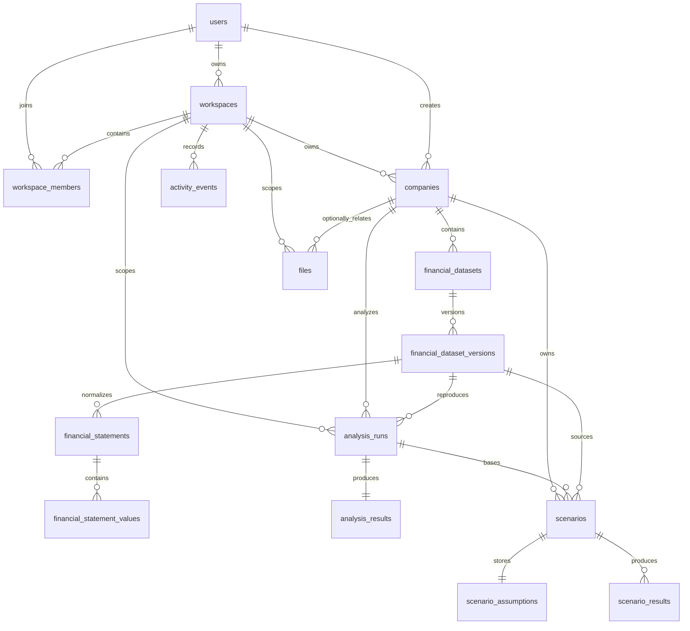

# Accounts and Workspace Persistence Architecture

## Purpose and boundaries

This backend turns EQUIVERSE into a tenant-scoped financial workspace without changing its browser-first product flows. PostgreSQL is the persistent source of truth for authenticated workspaces; existing local and session storage remains available for anonymous drafts and transient handoff alongside the account UI.

Financial calculations remain pure in `src/domain`. The persistence layer validates and stores canonical inputs, invokes the existing domain engine, and persists validated analytical snapshots. It does not implement ratios, score thresholds, DuPont, scenario transformations, or insights.

## Integration status

| Area | Implemented | Provisioned | Validated |
| --- | :---: | :---: | :---: |
| Drizzle schema, migrations, repositories and services | Yes | Yes | Clean PGlite and live Supabase checks |
| Supabase Auth server boundary | Yes | Yes | Synthetic email/password claims and account mapping |
| Supabase PostgreSQL | Yes, via Session Pooler `DATABASE_URL` | Yes | Migrations, schema, lineage and tenant validation |
| Supabase private Storage adapter | Yes | Yes | Private bucket, signed access and metadata linkage |
| EQUIVERSE account and workspace frontend | Yes | Yes | Server-action and server-component boundary covered by frontend tests |

The exact review evidence is in [integration-readiness-review.md](integration-readiness-review.md). The server-service contract used by the account UI is in [frontend-integration-contract.md](frontend-integration-contract.md).

## Technology decision

- **PostgreSQL** is the primary relational store: UUID identifiers, `numeric(20,6)` financial values, JSONB snapshots, foreign keys, and durable transaction semantics fit the financial lineage model.
- **Drizzle ORM** is the schema source of truth in `src/server/db/schema.ts`; its generated SQL migrations live in `drizzle/` and it supplies typed, parameterised PostgreSQL access.
- **Supabase Auth** owns authentication credentials and sessions. The business `users` table only maps an external identity to an internal UUID. It has no password, password hash, token, or secret fields.
- **Supabase Storage** is accessed through a project-owned `StorageService` interface for private objects. File bytes never enter PostgreSQL.
- **PGlite** runs clean-database migration and repository tests locally without production credentials. It is a test dependency, not the production database.

The selected stack was introduced because the repository had no pre-existing database or authentication implementation. It is small, strongly typed, migration-backed, and permits local validation without inventing cloud configuration.

## ERD



## Data dictionary and retention semantics

| Table | Purpose and important fields |
| --- | --- |
| `users` | Internal UUID mapped by unique `(auth_provider, auth_provider_user_id)` and unique email. Profile values are minimal and optional. |
| `workspaces` | Tenant boundary with `owner_user_id`, timestamps and `archived_at`. Creating a personal workspace creates an owner membership in one transaction; active owner/name pairs are unique so retrying bootstrap cannot duplicate the default workspace. |
| `workspace_members` | Unique `(workspace_id, user_id)` membership and constrained role: owner, admin, member, viewer. |
| `companies` | Workspace-owned company identity, industry, supported currency, creator lineage and soft archive. |
| `financial_datasets` | Named company dataset container, soft archivable. Archiving hides it from normal lists but cannot erase referenced immutable versions or analysis lineage. |
| `financial_dataset_versions` | Immutable numbered canonical-input snapshots. `canonical_input` is runtime-validated before storage and reading. |
| `financial_statements` / `financial_statement_values` | Four canonical statement groups for each of the three periods; values use PostgreSQL `numeric(20,6)` and canonical metric keys. |
| `analysis_runs` | Relational execution lineage: workspace, company, dataset version, requester, lifecycle state, engine and input schema versions, timestamps, safe failure code, optional idempotency key. |
| `analysis_results` | One versioned JSONB `financial_analysis` snapshot per run. Its envelope and key metric structures are runtime-validated before returning a domain result. |
| `scenarios`, `scenario_assumptions`, `scenario_results` | A scenario is tied to a completed base run and immutable source dataset version. Complete assumptions and result snapshot are versioned JSONB because the scenario controls and output are cohesive nested contracts. |
| `files` | Private object metadata only: scoped generated storage key, original filename, MIME type, bytes, checksum, category, uploader, and soft deletion. A deletion makes metadata unreachable before provider object cleanup. |
| `activity_events` | Minimal product activity metadata. It deliberately excludes credentials, tokens, full financial documents and raw result payloads. |

Important financial entities are archived rather than deleted by normal services. Foreign keys use explicit `RESTRICT`, `CASCADE`, and `SET NULL` rules so a company archive cannot destroy historical analysis. Statement rows cascade only with an unreferenced dataset-version deletion at the database layer; no application service mutates or deletes a dataset version.

## Authentication, session and authorization

Supabase Auth establishes identity. Server code calls `auth.getClaims()` through `@supabase/ssr` rather than trusting a browser-provided session object, maps the external identity with `requireAuthenticatedUser()`, and updates cookies via `src/proxy.ts`. Public product routes remain available for anonymous exploration. Account routes resolve the session through the same server boundary and redirect unauthenticated requests to sign in.

Every protected service follows this sequence: authenticated internal user, workspace membership, role action, then entity lookup constrained by the same workspace. This prevents IDOR access based on guessed UUIDs. UI visibility is never relied on for authorization.

| Capability | Owner | Admin | Member | Viewer |
| --- | :---: | :---: | :---: | :---: |
| Read workspace data, history and files | Yes | Yes | Yes | Yes |
| Create/update/archive companies | Yes | Yes | Yes | No |
| Create/version/archive datasets | Yes | Yes | Yes | No |
| Run analysis and create/update/archive scenarios | Yes | Yes | Yes | No |
| Upload/delete files | Yes | Yes | Yes | No |
| Manage workspace members | Yes | Yes | No | No |
| Archive workspace | Yes | No | No | No |

`docs/backend/supabase-rls-policies.sql` prepares optional Supabase Row Level Security as defense in depth. It is intentionally not part of the application migration chain: it references Supabase `auth.uid()` and must be applied only after a deliberate client-context database design. The validated current deployment has no RLS enabled on application tables and uses a trusted server-only Session Pooler connection, so server-side authorization remains mandatory.

## Analysis, scenario and activity flow

```text
immutable dataset version
  -> parseFinancialAnalysisInput()
  -> analyseFinancialStatements()
  -> validated AnalysisSnapshot JSONB
  -> completed analysis run + activity event
```

The run is recorded as `pending`, advanced to `running`, then completed atomically with one result. Failures are recorded as `failed` with a safe code and no partial result. Workspace, company, dataset, history, scenario, file and activity queries are workspace-authorized, ordered by `created_at` and UUID, and use an encoded timestamp-plus-ID cursor. Dataset versions and analysis results remain immutable; scenario updates can only change their human-facing name or description, never the assumptions or result lineage.

Scenario persistence only accepts a completed base analysis from the requested company and source version. It reuses the existing `applyScenario()` and analytical engine, then retains the assumption contract and output lineage. No scenario becomes canonical financial truth.

## Storage and file safety

`FileService` validates a narrow MIME allow-list (PDF, CSV, XLSX), a 20 MiB limit, and filenames before calling storage. Object keys are generated as `workspaces/{workspaceId}/companies/{companyId}/{uuid}` (or workspace scoped), never from a supplied path. PostgreSQL retains the original filename and SHA-256 checksum. Private signed URLs are created only after workspace authorization. A metadata failure removes the just-uploaded object.

Production storage requires a private Supabase bucket and a server-only `SUPABASE_SERVICE_ROLE_KEY`. Do not expose this key to browser code or commit it. The current local test adapter checks upload, signed retrieval, deletion and tenant scoping without provider credentials.

## Developer setup

1. Run `npm install`.
2. Copy `.env.example` into local environment configuration and set a real local PostgreSQL `DATABASE_URL`. Do not commit it.
3. Run `npm run db:migrate`.
4. Run `npm run db:seed` to create a synthetic development identity, personal workspace, NovaTech Solutions and Atlas Manufacturing Group datasets. The seed is idempotent and never runs automatically.
5. Run `npm run db:check` to make a safe `SELECT 1` connection check.
6. Run `npm run db:test` for clean PGlite migrations and backend-focused tests. For an intentionally configured non-production Supabase environment, run `npm run db:live:check`; it creates and cleans up synthetic validation data. Then use `npm run typecheck`, `npm run lint`, `npm run test`, `npm run build`.
7. Start the application with `npm run dev`. Anonymous analysis remains available without login; account routes require a configured Supabase session.

The required environment variable names are listed in `.env.example`; this repository contains no database URL, provider project ID, API key, OAuth secret, or service role credential.

## Supabase provisioning and operations

The current Supabase integration was validated through a Session Pooler connection using `npm run db:migrate`, `npm run db:check` and `npm run db:live:check`. Drizzle remains the only application-schema path. Future environments must still verify project identity, configure untracked environment values, create a private bucket, configure Auth redirect URLs and run the same synthetic validation before use. Do not run the fictional seed automatically in a production-like project.

After a project is available, use `npm run db:check` for a non-destructive database query and verify `/api/health` transitions from `503 {"status":"not-configured"}` to `200 {"status":"ready"}`. That endpoint is database-only; it does not claim Auth or Storage readiness. The separate live validation must cover account bootstrap, two-workspace isolation, dataset version lineage, analysis/scenario persistence, private upload/signed-read/delete, activity events and provider schema drift.

Define account deletion, workspace deletion, GDPR export/deletion, retention, orphaned-file cleanup and recovery procedures before handling non-fictional customer data. Production should use encrypted connections, restricted database roles, tested backups and migration rollback plans. The health endpoint reports only `ready`, `unavailable`, or `not-configured`, never connection details.

## Local-to-account migration

Current browser localStorage/sessionStorage data is deliberately preserved. The authenticated UI offers explicit opt-in import: validate local canonical input, create a user-owned workspace/company/dataset version, run a fresh persisted analysis, and then reopen its stored result. Browser storage is useful for anonymous work and caching, never the canonical account database.
