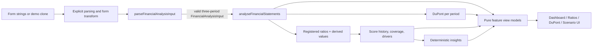
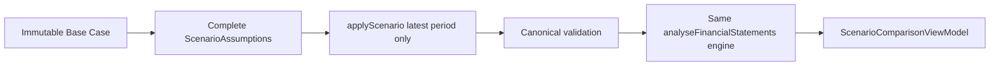

# Financial Engine Map

## Canonical pipeline

## Canonical model and validation

Source: `src/domain/types.ts`, `src/domain/schemas.ts`.

`FinancialAnalysisInput` is exactly a company profile plus a tuple of three periods. Required statement groups are Income Statement (revenue, COGS, EBIT, interest expense, net income), Balance Sheet (cash, receivables, inventory, current/total assets, current liabilities, debt, equity), Cash Flow (OCF, CapEx), and Working Capital (average inventory/receivables/payables). Currency is EUR/USD/GBP. All numeric values must be finite; years must be integer, unique, and old-to-new.

## Derived values and period convention

Source: `src/domain/calculations/*`.

- Gross Profit = Revenue - COGS
- Quick Assets = Current Assets - Inventory
- Working Capital = Current Assets - Current Liabilities
- Capital Employed = Total Assets - Current Liabilities
- Free Cash Flow = Operating Cash Flow - Capital Expenditure (CapEx entered positive)
- Average assets/equity/capital employed use `(previous closing + current closing) / 2`; for the oldest period, current closing balance is the documented fallback.

`MetricResult` is either `{ status: "available", value }` or an unavailable reason (`missing-input`, zero/non-meaningful denominator, insufficient history, invalid relationship). This distinction is contractual.

## Ratio registry

Source: `src/domain/ratios/registry.ts`; calculation functions are in category files.

| Category | Registered outputs |
| --- | --- |
| Profitability | Gross Profit, Gross Margin, EBIT Margin, Net Margin, ROA, ROE, ROCE |
| Liquidity | Current Ratio, Quick Ratio, Cash Ratio, Operating Cash Flow Ratio |
| Solvency | Debt-to-Equity, Debt-to-Assets, Equity Ratio, Interest Coverage |
| Efficiency | Asset Turnover, Inventory Turnover, Receivables Turnover, DSO, DIO, DPO, CCC |
| Cash Flow | OCF Margin, Free Cash Flow, FCF Margin, OCF-to-Net-Income |

Formula labels, units (percentage/multiple/days/currency), inputs, explanations and unavailable conditions live in the registry. The full formula reference is `docs/formulas.md`; V3 should source labels/metadata from this registry rather than duplicate them.

### Formula reference at a glance

| Group | Formulae and convention |
| --- | --- |
| Profitability | Gross Profit = Revenue - COGS; Gross/EBIT/Net Margin = respective value / Revenue; ROA = Net Income / average assets; ROE = Net Income / average equity; ROCE = EBIT / average capital employed. |
| Liquidity | Current Ratio = Current Assets / Current Liabilities; Quick Ratio = (Current Assets - Inventory) / Current Liabilities; Cash Ratio = Cash / Current Liabilities; OCF Ratio = Operating Cash Flow / Current Liabilities. |
| Solvency | Debt-to-Equity = Total Debt / Equity; Debt-to-Assets = Total Debt / Total Assets; Equity Ratio = Equity / Total Assets; Interest Coverage = EBIT / Interest Expense. |
| Efficiency | Asset Turnover = Revenue / average assets; Inventory Turnover = COGS / average inventory; Receivables Turnover = Revenue / average receivables; DSO = average receivables / Revenue x 365; DIO = average inventory / COGS x 365; DPO = average payables / COGS x 365; CCC = DSO + DIO - DPO. |
| Cash flow | OCF Margin = OCF / Revenue; FCF = OCF - CapEx; FCF Margin = FCF / Revenue; OCF-to-Net-Income = OCF / Net Income. |

Ratios return unavailable rather than fabricate a value whenever their denominator is zero or unsuitable under the registered safe-math policy. Percentages are stored as decimal values in the domain, multiples as raw ratios, days as day values, and FCF in the company currency.

## Score, coverage and insights

Source: `src/domain/scoring/config.ts`, `calculate-score.ts`, `src/domain/insights/generate-insights.ts`.

Five dimensions have configured weights: profitability 25%, liquidity 20%, solvency 20%, efficiency 15%, cash flow 20%. Eligible metric scores use declarative anchors and piecewise linear interpolation with higher-is-better, lower-is-better, or target-range modes, clipped 0-100. The implementation validates configuration before scoring.

Unavailable metrics receive no zero score. A dimension requires >=60% metric-weight coverage and at least two valid configured metrics. Total score requires >=70% analytical coverage and four available dimensions; remaining available items/dimensions are reweighted. Classifications: Strong >=80, Healthy >=65, Moderate >=50, Weak >=35, Critical <35, otherwise Unavailable. The complete anchors, metric weights, coverage, drivers and 18 deterministic insight rules are authoritative in `docs/scoring-methodology.md` and the scoring/insight sources.

## DuPont and attribution

Source: `src/domain/dupont/calculate-dupont.ts`, `driver-attribution.ts`.

`ROE = Net Profit Margin × Asset Turnover × Financial Leverage`; the latter uses average total assets / average equity. The UI must show raw factor levels and identity reconciliation separately from ROE-change attribution. Attribution is exact Shapley decomposition over all six factor substitution orders; factor contributions sum to current ROE minus prior ROE within documented tolerance, with no hidden residual.

## Scenario engine

Source: `src/domain/scenarios/*`; methodology: `docs/scenario-methodology.md`.

Controls: revenue growth, optional EBIT-margin target, debt change, current-assets change, inventory change, and interest-expense change. Transform order is fixed. The engine clones the base, never increments a previous scenario, and has deliberate limitations: no full balance-sheet balance, tax model, financing schedule, or forecast. Presets are not forecasts.
