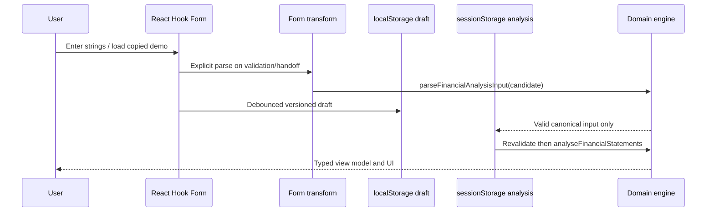

# Data Flow and State

## Input-to-analysis state flow

## State ownership

- **Financial input:** one React Hook Form instance in `FinancialInputWorkflow`; numbers/years remain strings in `FinancialInputFormValues` until `form-transform.ts` explicitly parses them.
- **Workflow UI:** current step, completed steps, demo marker, local-draft status, and autosave suppression are component state/ref only.
- **Draft:** `localStorage` key `financial-ratio-analyzer:input-draft:v1`; schema version, timestamp, active step, raw form values. Strict recovery rejects incomplete/legacy/corrupt shapes.
- **Active analysis:** `sessionStorage` key `financial-ratio-analyzer:active-analysis:v1`; canonical data, schema version, timestamp. It is re-parsed before every analysis-facing route.
- **Dashboard/ratio/DuPont:** browser-only session boundaries recover safe state after mount, call pure analysis/builders, and render typed props. No storage in domain code.
- **Scenario:** client component owns a complete `ScenarioAssumptions` value and selected preset. `useMemo` derives a fresh pipeline result from immutable base data, not an accumulated scenario.

## Current versus previous semantics

Canonical periods are old-to-new. The last is current, the second-last is comparison/prior. Ratios that use average balance receive the immediately preceding closing period; oldest uses current balance fallback. Score history always contains three periods. Dashboards must label current/prior explicitly and never assume calendar labels other than supplied years.

## Failure and recovery contracts

Analysis-facing session boundaries distinguish loading, absent session, unreadable JSON, canonical validation failure, and calculation failure. They do not silently load a demo and must not leave stale partial content visible. Scenario adds transformation and post-transform canonical failures. Input has field errors, blocking errors, warnings, and informational notices.

## Browser/client boundary

Routes remain thin server entries. Browser storage and interactive forms/charts live behind client components. Pure domain, option-builder and view-model code must remain browser-independent; visual components receive typed props and format values with central helpers.
