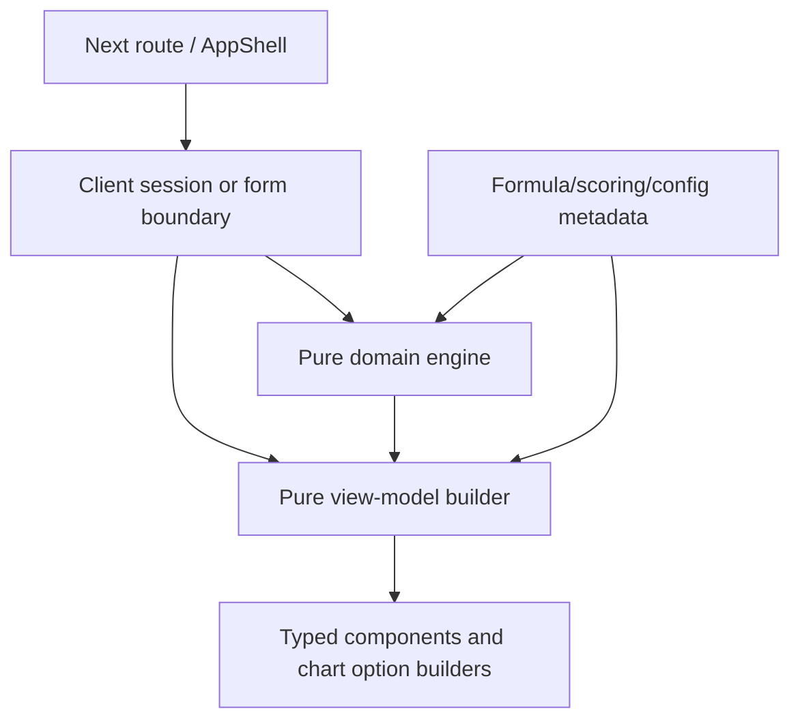

# Frontend Architecture

## Stack and rendering

- Next.js App Router (`src/app`), React 19, TypeScript, Tailwind CSS 4.
- Route files are intentionally thin. Interactive state and storage live in client feature boundaries.
- `zod` validates canonical input; `react-hook-form` owns the single input workflow form; `echarts` is directly installed and used through project-owned chart components; `lucide-react` supplies icons; `framer-motion` is available.
- Tests use Vitest + Testing Library + jsdom.

## Layering

## Reusable areas

| Area | Location | V3 reuse rule |
| --- | --- | --- |
| Domain engine | `src/domain/**` | Reuse directly; no visual imports/browser APIs. |
| Input boundary | `src/features/financial-input/*` | Reuse parser, transform, validation, persistence, field metadata, demo fixtures; V3 may replace markup. |
| Dashboard | `src/features/executive-dashboard/*` | Reuse recovery, formatting, view-model builders, chart theme/container/options; V3 may create its own components. |
| Ratio/DuPont/Scenario | `src/features/{ratio-analysis,dupont-analysis,scenario-lab}` | Reuse recovery/builders/types/charts; avoid copying calculations. |
| Shared primitives | `src/components/ui`, `src/components/layout` | May be reused or isolated per V3; do not globally overwrite existing components. |
| Design tokens | `src/app/globals.css` | Existing tokens are baseline. V3 should introduce scoped tokens rather than mutate those globally. |

## Charts and accessibility

`ChartContainer` handles client-only ECharts, resize, disposal, loading/empty/error, accessible name/description/summary, reduced motion and transparent theme. Option builders are pure. Existing chart types include dimension radar, score trend, ratio trend, profitability bridge, score contribution, scenario dimension comparison, DuPont attribution and factor trends. V3 must not recalculate financial metrics in React.

Tailwind `sm`, `md`, `lg`, `xl` grids, `min-w-0`, locally scrolling tables and visible labels underpin responsive views. `globals.css` defines 320px minimum, focus, print and reduced-motion behaviour.

## V3 isolation recommendation

Create a new feature directory such as `src/features/stitch-v3/` with its own components, scoped CSS/tokens, layout and page adapters. It can call existing recovery/builders or extract shared nonvisual hooks only when parity is tested. It must not modify current route components, base AppShell, Existing V1 CSS, or premium worktree files as part of initial integration.
